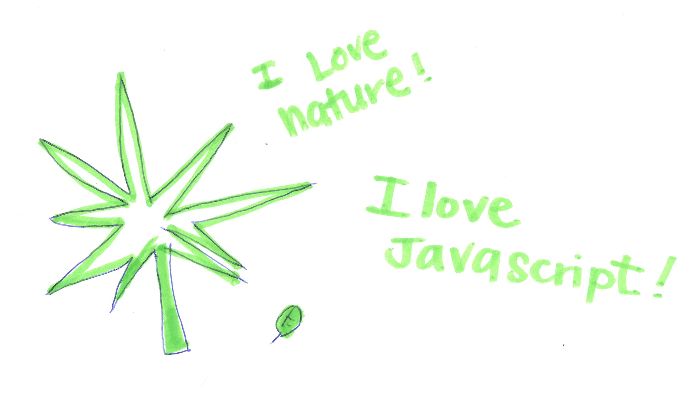
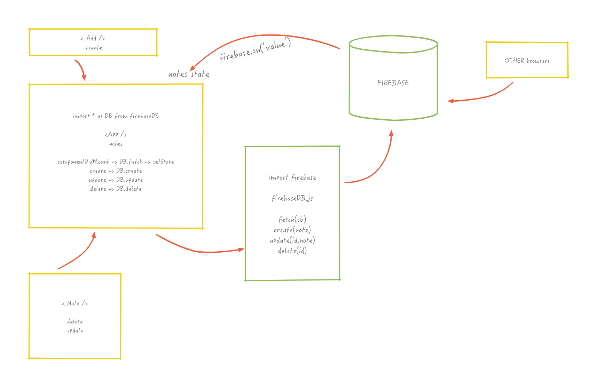
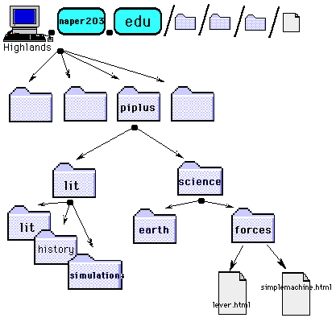
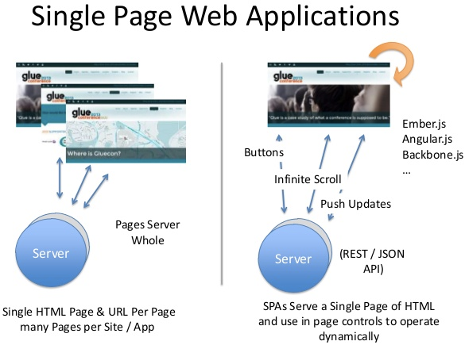
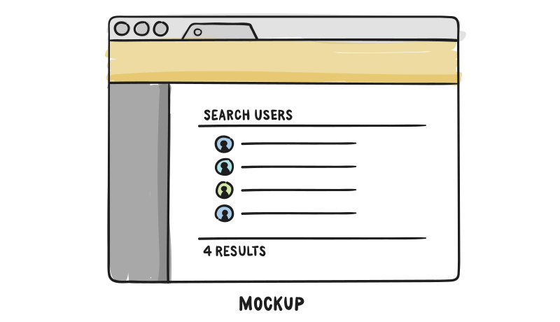
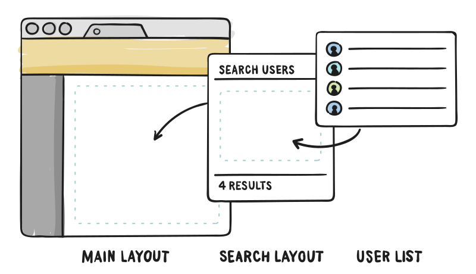
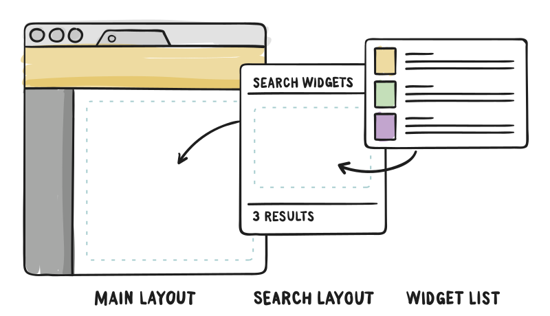
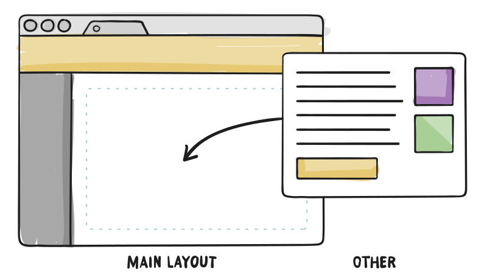

layout: true
class: center, middle
name: pic
background-size: contain

---

layout: true
class: center, top
name: fragment

.title[{{name}}]

---
layout: true
class: center, middle
name: base

.title[{{name}}]


---
name: CS52 Art


.large[]


???
* how's lab?
* js stuff?
* firebase module?


---
name: CS52 Art





???
* wrapper module
* there will be a websockets intro were we can replace what firebase is to us fairly quickly with websockets


---
name: CS52 Art


.medium[]


???
* noooooo
* hopefully JS is starting to make a little bit of sense
* anything we should go over?


---
name: Speaking of boomerangs


.medium_small[]


???
* 5-6pm DALI - pizza i think
* ben packer - one of the minds behind boomsync
* if you're looking for promises and free food


---
name: CS52 Art

.left[
.large[]

]

.right[
.medium[]
]


???
*


---
name: Announcements

.small[]

* Pitch Signups!
* Lab 3 extension
* SA5: Routing (super easy) due Thurs
* SA6: Redux out Weds
* Tiny Quiz Thurs

???
* only one pitch signup so far - its 2 minutes, if you don't sign up i'll just assign final projects!
* there will be another short for redux going out soon.
* these are all super short just to get your starterpacks up and ready


---
name: Routing Frontend

`http://yummyserver.com/food/id/#/section?id=23j32j3j`

.medium_small[]


???
* what if you want to pass some state into the url
* or have a url that is meaningful to the user to help indicate where they are
* what the what, who keeps track of all that junk
* https://ed.fnal.gov/lincon/tech_web_links_types.shtml
* https://www.slideshare.net/rfreebern/the-ux-of-urls


---
name:


.medium[]

* app in browser
* routes?

???
* remember single page apps?
* lives in the browser  - javascript application basically


---
name:


.medium[]


???
* http://www.slideshare.net/3scale/the-api-and-appification-of-the-web
* https://eager.io/blog/the-history-of-the-url-path-fragment-query-auth/?h


---
name: clean urls?

.medium[]

???
* remember parts of the url again
* if we had to choose between path, query and fragment for making a url that looks nice which?


---
name: enter frontend routing

`http://cs52-notes.cool/boardid`


* `/posts/super_interesting_post`
* app needs to know about this

???
* lets call this thing a route
* now our javascript app needs to know about this
* remember what we have currently been building are basically fully js apps


---
name: Basic Browser

* maintains a history of URLs visited
  * back
  * forward
* reloads page on navigation
  * killing js
  * cookies stay

???
* stepping back a sec to basic browser functionality
* default browser actions
* loading pages from scratch


---
name: reloads on

* location bar typing
* forward/back buttons
* page refresh operation
* javascript assignments to `window.location`

???
* what we want is to change url without refresh


---
name: Attempt 1: Hash History

* http://example.com
* http://example.com#fragment
* http://example.com?id=3535
* http://example.com?id=3535#fragment


???
* can already change fragments and query parameters wihtout reload
* some early frontend frameworks only used hash history


---
name: Navigation Away

```javascript

window.onbeforeunload = function(e) {
  return 'are you sure you want to leave this page?';
}

```

???
* loss of state on navigation away from page


---
name: desired behavior

* do the right thing:
  * browser page history
  * navigate with forward and back buttons
  * navigate away and come back to the app
  * bookmark a place in the app
  * copy the URL and share it
  * refresh reloads to same place

???
* loss of state on navigation away from page


---
name: that would be perfect, thanks

<iframe src="//giphy.com/embed/p5yJjfLjyNjy0" width="580" height="370" frameBorder="0" class="giphy-embed" allowFullScreen></iframe>

???
* owls are so cool


---
name: Deep Linking

`https://www.amazon.com/Building-Isomorphic-JavaScript-Apps-Implementation/dp/1491932937/ref=sr_1_5?ie=UTF8&qid=1493142393&sr=8-5&keywords=react`

* state in urls:
  * how much state/ui context to encode?
  * url sharing is standard
* share buttons to generate special urls

???
* how much of app state to include
* state/ui context meaning if in app, do you have menus open? editing some field?
* probably not everthing
* notice amazon links have a lot of stuff encoded in them


---
name: App Init from URL

* old ugly way: http://www.example.org/?show=posts?id=s987s9d&type=today&user=320s9s8
* new clean urls: http://www.example.org/posts/07-22-16

???
* clean urls better!


---
name: HTML5 History API

```javascript

history.forward();
history.back();

history.pushState([data], [title], [url]);

// and others
```

http://html5demos.com/history

???
* allow JS access to history
* change url with history without reloading page
* mostly supported these days
* http://diveintohtml5.info/history.html


---
name:


.medium[]

[https://reacttraining.com/react-router](https://reacttraining.com/react-router)

???
* react wraps all that js-dom history stuff
* and allows us to define routes more easily!


---
name:


"React Router keeps your UI in sync with the URL."

* reusable layout
* url routes
* nested routes
* matching
* declarative jsx
* composable (new)

???
* simply put, keeps ui logic matching the url
* reusable layout


---
name:




*(from [css-tricks](https://css-tricks.com/learning-react-router/))*

???
* here's a common layout with some components


---
name:


http://somedomain.com/users




???
* nav
* sidebar
* and some inner components


---
name:


http://somedomain.com/widgets




???
* and maybe we can search users, or widgets


---
name:


http://somedomain.com/other




???
* or even replace the search with some other view


---
name: Manual Labor

```javascript
renderInner() {
  if (this.state.showUsers) {
    return <ShowUsers />;
  } else {
    return <ShowWidgets />;
  }
}

render() {
  <div>
    <Nav />
      {renderInner()}
    <Footer />
  </div>
}
```

???
* given our current state of information
* we might do something like this no?
* but what if we wanted to have multiple layouts?
* and especially if we wanted to change this based on url?


---
name: React Router

```html
<Nav />
<Switch>
  <Route exact path="/" component={Home}>
  <Route path='/users' component={Users} />
  <Route path='/widgets' component={Widgets} />
</Switch>
<Footer />
```


???
* more declarative
* connected to urls
* just same old JSX notation!


---
name: Defining


```html
<Route exact path='/' component={Home} />
<Route path='/users' component={Users} />
```

???
* basic route definition
* component and path -
* match can be exact or substring


---
name: Nesting


```html
const Posts = (props) => {
  <div>
    <Route path={`${props.match.url}/:postid`} component={Post}/>
    <Route exact path={props.match.url} render={() => (
      <h1>select a post</h1>
    )} />
  </div>
}
<Route path="/posts" component={Posts} />
```

`props.match`


???
* can nest components
* props.match is cool
* can extract url for instance
* but also parameters


---
name: component wrapping tangent

```html
// App

render() {
  <MainLayout>
    {(this.state.isLoggedIn) ? <Profile /> : <Login /> }
  </MainLayout>
}
```

```html
// MainLayout
render() {
  <div>
    <nav />
    {this.props.children}
    <footer />
  </div>
}
```


???
* all there is to it. this.props.children will contain all the componets that are nested.
* Routes do something similar in that they wrap a component
* you can do this with other components also if you want to add functionality for instance


---
name: FallBack Route

```html
<Nav />
<Switch>
  <Route exact path="/" component={Home}>
  <Route path='/users' component={Users} />
  <Route path='/widgets' component={Widgets} />
  <Route component={FallBack}
</Switch>
<Footer />
```

???
* can define a route that matches if all other routes fail


---
name: Linking and Pushing

```html
<ul>
  <li><Link exact to="/">Home</Link></li>
  <li><NavLink to="/users">Users</NavLink></li>
  <li><NavLink to="/widgets">Widgets</NavLink></li>
</ul>
```

```javascript
handleClick() {
  this.props.history.push('/some/path');
}
// must use: export default withRouter(MyComponent)
```

???
* use Link or NavLink to avoid reloads and use router
* need to use withRouter to have props.history available in a component
* NavLink will add an 'active' class to current match


---
name: Route matching and Params

```html
<Route path="users/:userId" component={UserProfile} />
```

```javascript
//UserProfile
const url = `https://api.com/users/${props.match.params.userId}`;

fetch(url, { method: 'get'})
  .then(function(profile) {
    this.setState({user: profile})
  })
```

???
* available in props.match.params
* pretty common, posts, users, etc
* we'll use this for next hw
* but can use for multiple boards for instance


---
name: 404!

* no requests being made to the server except first app load
* BUT if first load is to specific resource...
* serve needs to return index.html for all server side routes
* surge:  `200.html`
* can't do this on gh-pages... sadly

???
* will cover more on this later


---
name: Deprecated methods

* React Router under heavy development, new version as of 12 days ago
* stackoverlow has lots of outdated info about react router v2,3

???


---
name: panda time


.tiny[]

???
* panda time
* is question time
