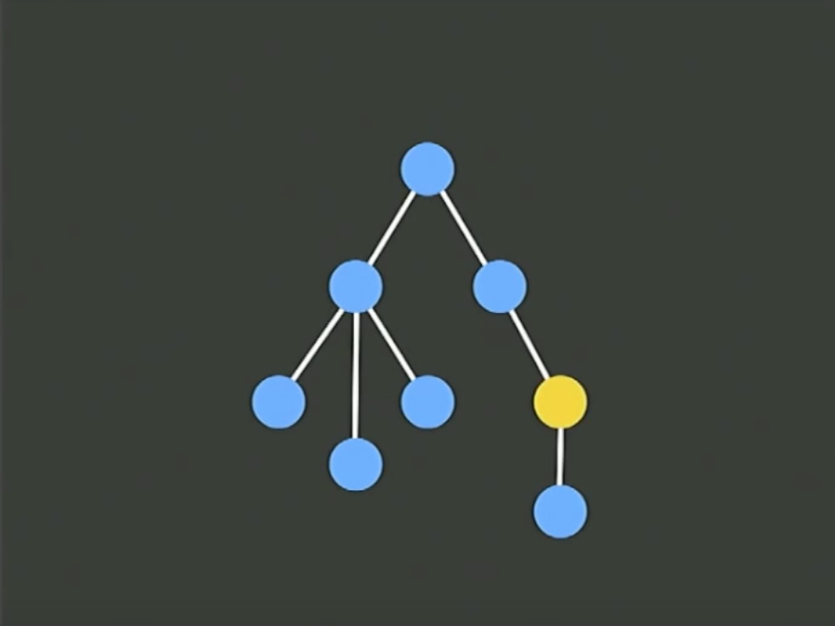

layout: true
class: center, middle
name: pic
background-size: contain

---

layout: true
class: center, top
name: fragment

.title[{{name}}]

---
layout: true
class: center, middle
name: base

.title[{{name}}]

---
name: Immutability, BAAS, Promises


---
name: CS52 Immutability


???


---
name: Course Survey Results

<iframe src="https://dalilab.typeform.com/report/IXG61z/FKXP"  width="900" height="500" frameBorder="0" ></iframe>

???
* Soo, too fast!
* more question sections and will slow down lecture material
* we're a little behind the master plan, but thats ok!
* majority understanding majority of material
* stuff will start making more sense
* lots to learn, but we'll make it


---
name: Classroom Utilization

* "smaller breakout-sessions/workshops"
* "use projectors more"
* "more challenging table workshops"
* "like it"
* "more interactive"

???
* duly noted, lets do more!
* everybody should download the client and we'll play with projectors a bit later


---
name: Things That Were Liked

* "useful and cool assignments"
* "material is interesting and the group is enthusiastic"
* "projects are cool"
* "grading [...] assignments reward revision / creativity / EC"
* "breadth / cutting edge"
* "learning environment"
* "seem real and applicable and fun"
* "love read-through tutorials"
* "not afraid to ask for help"
* "collaborative moments"
* "first computer science course in which I've truly been engaged and passionate about my work"

???
* these are great, so we're doing some things right!


---
name: Things To Improve

* "make quizzes have unlimited retakes"
* "slow down pace / near impossible to understand"
* "relate examples in lecture to assignments"
* "more core concepts / html/css/js"
* "more syntax"
* "more conceptual explanations"
* "more lecture notes"
* "too much mindless cp/paste"
* "workshops get cut off / make longer"
* "workshops don't add anything"
* "longer assignments"
* "help hours at bad times"

???
* difference between the SA and HWs
* lecture notes (s in slides) but yeah for next time i'll definitely expand these
* quizzes are under review, but we'll have one next week :-)
* x-hour


---
name: Javascript Fatigue Aside

[{: .medium}](https://medium.com/@pistacchio/i-m-a-web-developer-and-i-ve-been-stuck-with-the-simplest-app-for-the-last-10-days-fb5c50917df#.imprd0m6d)

{: .medium}

???
* so if you are confused, thats ok, the whole world is confused about webdev!
* proliferation of technologies
* everybody trying to fix the problem different ways
* new standards coming out all the time


---
name: Questions

* new questions time all the time!

???


---
name: Office Hours

* underutilized
* other time?
* **invoking individual meeting rule**

???
* Tuesday eve?  Sunday eve? I live in sudi
* everybody should now have access to sudikoff
* in one of my fav classes prof did a 15 minute individual meeting with every student
* will send around sign up sheet, but in a week or two need to rework a few more of the assignments first


---
name: Peer Mentoring

* hasn't quite worked out
* rethinking it

???
* its an important part
* thinking of doing a shoutout system for some undetermined grade effect
* for groups who are signed up please continue to show up
* any thoughts ideas?


---
name: Pitch Sign Ups!

[On Canvas!](https://canvas.dartmouth.edu/courses/15258/assignments/79662) Due Sunday

???
* do it, or i'll just have to assign all of my own ideas!


---
name: Immutability


<iframe width="640" height="480" src="https://www.youtube.com/embed/otCpCn0l4Wo?start=15&amp;controls=0&amp;showinfo=0" frameborder="0" allowfullscreen></iframe><br>

???
* immutable data structures
* once created can't be touched
  * ie modified  


---
name: but why?

```javascript
// first problem
let identity;
identity = 'one thing';
identity = 'another thing';
identity = 0;
identity = 'what will identity be in the future?';
```

???


---
name: time and value


<iframe src="//giphy.com/embed/xsF1FSDbjguis" width="480" height="250" frameBorder="0" class="giphy-embed" allowFullScreen></iframe>


???
* how do you track when something changes
* when you go back in time and try to change stuff, bad shit happens


---
name: side effects

```javascript

function obtuse(value) {
  const data = someFunc(value, instanceVar1);
  instanceVar2 = data + 1;
  console.log(data);
}

obtuse(0);
```


???
* so much leakage in this example you have no idea what is happening
* hard to test, have multiple dependent variables -- as with science, too many dependent variables is bad
* TDD
* practical aspects and paradigms in coding that arent' taught elsewhere
* webpack vs make


---
name: what changed

```javascript
videos = ['video1', 'video2'];

$('.video li').forEach( (el, i) => {
  el.text(videos[i]);
});

fetch(url, (newVideos) => {
  videos += newVideos;
  // now what?
})

```

???
* counter somewhere else on the page
* maybe a delete function elsewhere on page
* react immutable state is the answer here
* does this make sense


---
name: other solutions

* create complex models that keep track of dirty data
* re-run render often manually (backbonejs)
* chaos

???
* well or there is reacts nice state first views
*


---
name: State -> Render

```javascript
this.state.setState({foo:'bar'});


render() {
  <div>this.state.foo</div>
}
```

```javascript
// mutating, data loss and unpredictable behavior
this.state.foo = 'not bar';
this.state.setState(this.state);

// vs shallow clone of object
const newState = Object.assign({}, this.state, {foo: 'not bar'});
this.state.setState(newState);

// neither looks good
```


???
* react to the rescue
* trick to state:
  * render is pure function
  * state is updated to new state not mutated


---
name: String

* strings are typically immutable in most languages!

```javascript
let foo = 'I am a string';
let bar = foo.toUpperCase();

bar == 'I AM A STRING';
foo == 'I am a string';
```

???
* great, you've all already worked with immutable data structures!


---
name: But not so array

```javascript
let arr = [];
let v2 = arr.push(2);

v2 == 1; //length of array
arr == [2];
```

???
* original array is gonezo


---
name:

{: .medium}

```javascript
let arr = Immutable.Array([1,2,3]);
let v2 = arr.push(4);

v2 == [1,2,3,4];
arr = [1,2,3]
```

???
* no data loss


---
name: Inefficient you ask?

<div class='left' style='float:left;width:48%' markdown="1">
{: .medium}
</div>

<div class='right' style='float:left;width:48%' markdown="1">
{: .medium}
</div>

<br>

???
* Structural Sharing
* Directed Acyclic Graph
* ok so its efficient $O(log32 N)$
* https://www.youtube.com/watch?v=YFP8lbdZ0cs


---
name: Immutable Objects

```javascript
let note = Immutable.Map({
  title: 'hi',
  content: 'stuff',
});

let updatedNote = note.update({title: 'bye'});
```

???


---
name: Efficient Undo

```javascript
const history = [];
let note = Immutable.Map({
  title: 'hi',
  content: 'stuff',
});

// updating note
history.push(note);
note = note.update({content: 'real import stuff'});

// voila you has undo!
```


???


---
name: React and Immutable

* made for each other
* no need for cloning objects or copying arrays
* Immutable has simple nice api

```javascript
//init
this.state.whatever = Immutable.Map();

//add something in
this.setState(this.state.whatever.push({foo: 'hello'}));

```


???
* literally made for each other at facebook


---
name: Cool


???


---
name:

{: .medium}

* BAAS
  * realtime data store
  * nice api
  * notifications
  * admin portal
  * scalability

???
* backend as a service
* json storage -- who remembers JSON?


---
name: json data structures

```json
{
  "noteboard list": {
    "1": { "id":"notes from cs52", "author": "Ada Lovelace" },
    "2": { "id": "travel ideas", "author": "tim" }
  },
  "notes from cs52": {
    "1": {
      "title": "such great class",
      "content": "lectures are too fast"
    },
    "2": { ... }
  },
  "travel ideas": { ... }
}
```

???
* more here: https://firebase.google.com/docs/database/web/structure-data
* don't nest too far
* document types (mongo will be similar)
* users
* notes


---
name: realtime database api

```javascript
//push()
const userId = firebase.database().ref('users').push({username: name}).key()

//set()
firebase.database().ref(`users/${userId}`).set({
  username: name,
  email: email
});

//update()
firebase.database().ref('users').update({id: userId, email: newEmail});

//remove()
firebase.database().ref('users').child(userId).remove();
```

???
* push appends data to dictionary
* set overwrites if exists
* updates


---
name: writing


<p data-height="450" data-theme-id="24117" data-slug-hash="bfb7e2fcd1f8f4d3816e20160faf8648" data-default-tab="js,result" data-user="timofei" data-embed-version="2" data-editable="true" class="codepen">See the Pen <a href="https://codepen.io/timofei/pen/bfb7e2fcd1f8f4d3816e20160faf8648/">React Comment Box with Firebase</a> by Tim Tregubov (<a href="http://codepen.io/timofei">@timofei</a>) on <a href="http://codepen.io">CodePen</a>.</p>

???


---
name: reading

<p data-height="450" data-theme-id="24117" data-slug-hash="bab1c926da57c4136b409b49ec364c8d" data-default-tab="js,result" data-user="timofei" data-embed-version="2" data-editable="true" class="codepen">See the Pen <a href="http://codepen.io/timofei/pen/bab1c926da57c4136b409b49ec364c8d/">React Firebase Comments Only</a> by Tim Tregubov (<a href="http://codepen.io/timofei">@timofei</a>) on <a href="http://codepen.io">CodePen</a>.</p>

self-recursion: [http://cs52.me/slides/w5c1/#/3/4](http://cs52.me/slides/w5c1/#/3/4)

???


---
name: Callback and Promises

<iframe src="//giphy.com/embed/FKi8xl7OAreCI" width="480" height="269" frameBorder="0" class="giphy-embed" allowFullScreen></iframe>

???


---
name: Callback Simulation

<p data-height="400" data-theme-id="24117" data-slug-hash="7695b67d77d1282779bfb48e0d3ab863" data-default-tab="js,result" data-user="timofei" data-embed-version="2" data-editable="true" class="codepen">See the Pen <a href="http://codepen.io/timofei/pen/7695b67d77d1282779bfb48e0d3ab863/">callback hell playground</a> by Tim Tregubov (<a href="http://codepen.io/timofei">@timofei</a>) on <a href="http://codepen.io">CodePen</a>.</p>


???


---
name: Promises Simulation

<p data-height="403" data-theme-id="24117" data-slug-hash="67475ea03f33ac4ca0469c9c2ee14552" data-default-tab="js,result" data-user="timofei" data-embed-version="2" class="codepen">See the Pen <a href="http://codepen.io/timofei/pen/67475ea03f33ac4ca0469c9c2ee14552/">promise playground</a> by Tim Tregubov (<a href="http://codepen.io/timofei">@timofei</a>) on <a href="http://codepen.io">CodePen</a>.</p>

???


---
name: Promises


{: .medium}

self-recursion: [http://cs52.me/slides/w5c1/#/4/3](http://cs52.me/slides/w5c1/#/4/3)

???
* here is how promises work?
* shall we do an exercise


---
name: Question Time


<iframe src="//giphy.com/embed/jTZVegIrdLCCY" width="480" height="360" frameBorder="0" class="giphy-embed" allowFullScreen></iframe>

???


---
name: Workshop == HW3


???
