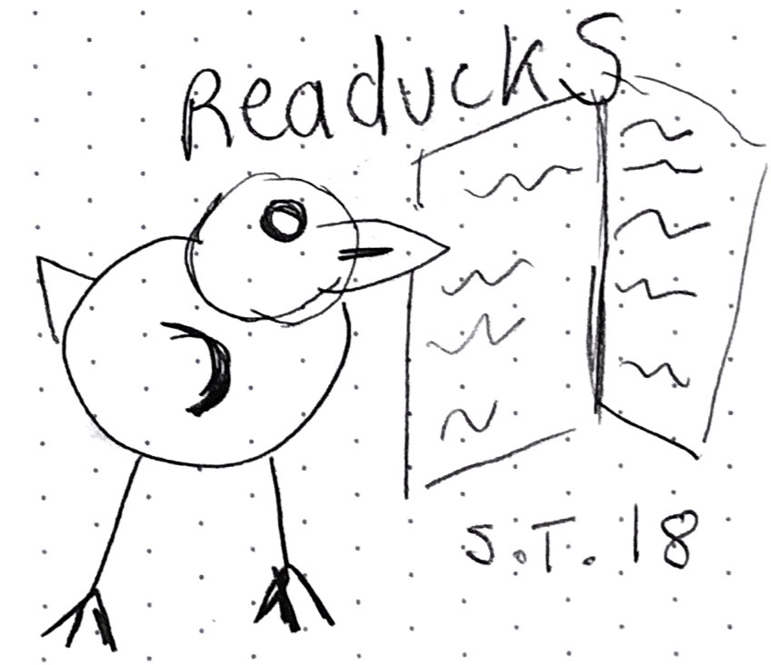
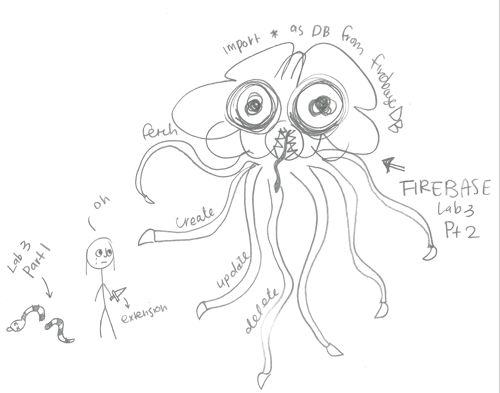
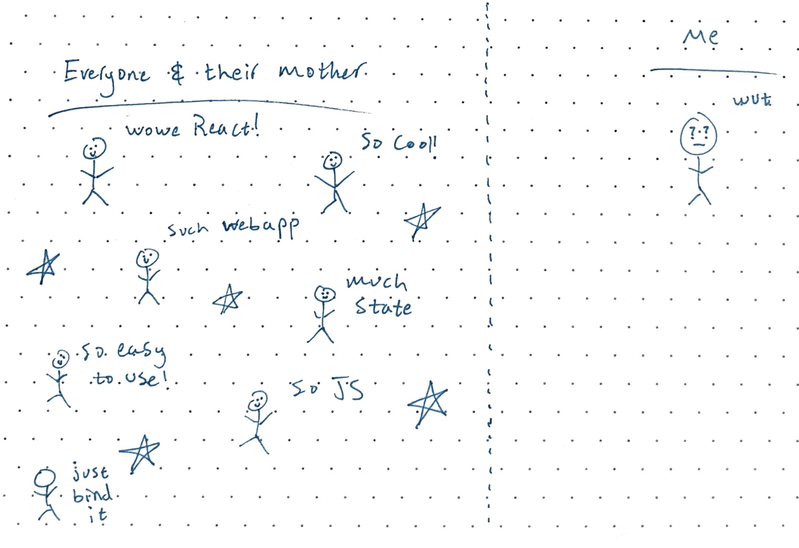
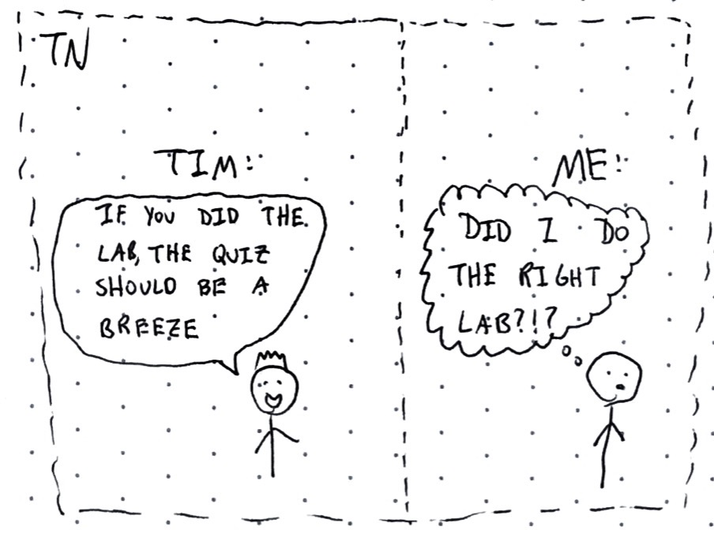

layout: true
class: center, middle
name: pic
background-size: contain

---

layout: true
class: center, top
name: fragment

.title[{{name}}]

---
layout: true
class: center, middle
name: base

.title[{{name}}]

---
name: Redux


.medium[]


---
name: CS52 Art

.left[]

.right[]


???
*


<!-- name: CS52 Art


.medium[] -->


<!-- name: CS52 Art

.medium[]
// add the above to react intro yes please


* what are benefits of firebase over other stuff like amazon aws?
* what is robots.txt for?
* can JS push fake history to user's browser? -->


---
name: CS52 Art

.tiny[]
.tiny[]


???
* let's go over a couple of parts of the quiz.
* also took a quick look at the survey results and sounds like it is going a bit fast for about half the class - i'll post more results from the survey next week but for now, i'll simplify the labs a little bit. last year the labs seemed to go a little bit smoother
* can add in another TA time - would a morning work? 


---
name: React Notes

https://chibuzo-cs52-notes.surge.sh/  login, undo, delete

http://adityachoudhari-cs52-lab3-reactnotes.surge.sh/ login undo zindex

https://samihadatta-reactnotes.surge.sh/  someones friends got a hold of theirs

style https://cdnb.surge.sh/

pointer change: https://srishti-cs52-notes.surge.sh/

auth: https://annebailey-noteboard.surge.sh/ 

puppy style: https://rodrigo-cs52-notes.surge.sh/

https://georginadavis-cs52-lab3-reactnotes.surge.sh/


https://jacksonharris-cs52-reactnotes.surge.sh/

skeumorphic design http://alexfeng-cs52-notes.surge.sh/

material framework: https://selim-cs52-lab4-notes2keep.surge.sh/

content -plz don't delete: https://stickynotes.surge.sh/

edit notification:  https://aarishiyer-cs52-reactnotes.surge.sh/

bright: https://tonymilne1-cs52-lab3.surge.sh/

setting colors: https://josephnotis-cs52-reactnotes.surge.sh/

space: https://juliettepouchol-cs52-reactnotes.surge.sh/

font colors: https://katherinetaylor-cs52-react.surge.sh./

https://tvergho-cs52-reactnotes.surge.sh/  undo and new boards

theme: https://leaflets.surge.sh/


* [low poly](http://taylorolson-cs52-lab3.surge.sh/)
* [minimizing notes](http://emma-cs52-notes.surge.sh/)
* [google and boards](http://react-notes-board.surge.sh/)
* [colors](http://regina-yan-cs52-lab3.surge.sh/)
* [zIndex](http://mihovilm-cs52-lab3.surge.sh/)
* [piggies!](http://welcometomyfarm.surge.sh/)
* [background](http://danah-cs52-notes-app.surge.sh/)
* [hi tas](http://zacgottschall-cs52-react-notes.surge.sh/)
* [classy](http://sheppard-cs52-lab3-react-notes.surge.sh/)
* [favicon award](http://angi-cs52-lab3.surge.sh/)
* [domain name award](https://reactnotes.surge.sh/)
* [auth](https://jot-cs52.surge.sh/)


???

* some examples


---
name: What do we know about React so far?

* components
* unidirectional data flow
* events and callbacks
* state and props
* rendering jsx


???


---
name: Problems

.medium[]


???
* look familiar? we will fix it


---
name: Smart and Dumb components

.small[]


* smart components have state + props
* dumb components only props (function)

???
* dumb components can react too


---
name: Presentational and Container Components

* ***presentational***
  * concerned with how things look
  * have state for ui things but not data
  * generally get data as props
  * real view
  * reusable (your mini bootstrap)
* ***container***
  * concerned with data
  * pass data to presentational components
  * binds callbacks to self
  * can be *connected*

???
* so far we'd had both
* we've not really talked about this abstraction
* but will have a bit more of it soon with redux!


---
name: Flux

<iframe width="640" height="360" src="https://www.youtube.com/embed/nYkdrAPrdcw?rel=0&amp;showinfo=0" frameborder="0" allowfullscreen></iframe>

???
* facebook's answer to scalability
* interesting worth watching


---
name: The beginning


???
* multiple parts of webpage that tracked messages in different ways
* had a messenger window but also unread count


---
name: questionable design


???
* bugs were insidious
* how do you handle both staying in synch - read in one meant mark as read in another
* had multiple data models responsible for each view
* updating one model would need to update another
  * unread thread count
  * unread messages
* had unread counts that were false positive


---
name: Chat

.medium[]


???
* increment unseen
* append message in chat
* if open append message in messages Views
* if chat tab is focused or messages is open - decrement unseen
* complex login living in multiple places
* imperative lots of steps with checks


---
name: Chat

.medium[]


???
* problem kept coming back as they fixed things due to complexity
* here's what the basic logic looked like
* handler had too much to do
* large amount of centralized logic is one solution but have to code for consistency problems
* chat tabs is easy - get a new message - append it
* less clear about unseen
* perhaps storing unseen as a list by threadID would be better
* use *explicit data* - actual unseen threads, not just counter
* moving display logic to each component so it can decide based on data how to render (sound familiar)
* separating data from view
* wanted to move these decisions closer to the actual views.


---
name: MVC

.medium[]


???
* two way binding here


---
name: MVC Problems

.medium[]


???
* too much stuff to keep track off
* data changing over time
* would you be able to tell if there is an infinite loop - one model updating another and back


---
name: Enter Flux


???
* unidirectional data flow
* thanks facebook
* predictable - no multiple arrows
* finish a layer you are done
* with multiple Views easy as arrows go in one direction
* easy to reason about
* data changes - views update
* except that is more global and neat


---
name: unidirectional data flow


???
* track an action through the system
* easy consistency


---
name: Flow Based Programming


???
* can imagine testing is easy


---
name: MVC -> Flux

* loosely:
  * Views -> Views (React Components)
  * Controller -> Views (Container Components)
  * Model -> Store (also ~state)


???
* how do we convert one way of reasoning to another?


---
name:


???
* flux was a bit tricky
* dan abramov comes up with answer - REDUX


---
name:

.small[]

.small[] 7/2016

.small[] 4/2017

.small[] 4/2018

.small[] 4/2019


???
* Redux - a flux framework for the rest of us
* flux was more a paradigm
* redux takes those principles and makes them functional and awesome


---
name: Application Level State

* react is great
* but could use better data management
* Redux
  * data, model, controller
  * single object stores app state!


???
* so far we'd done,  component level state vs application level state
* we've used components to allow us to pass down component level state in props
* but not ideal solution


---
name: React Component Props


???
* not ideal, why do the parents need to know for instance?


---
name: Add a dash of Redux


???
* what if we had an application level store of data
* where a component can dispatch an action
* and others can subscribe to data - NOT EVENTS BUT ACTUAL DATA


---
name: Together at Last


???


---
name: State & Actions


???
* dispatch sends actions to reducers which return new state given old state


---
name: Multiple Reducers


???
* lets dance


---
name: In motion

.medium[]


???
* and here's how it all moves Together
* state comes in together with action to form new state


---
name: example

.medium[]


???
* lets take youtube app
* had some complicated double layer wiring
* would have been nice not to pass so much stuff in props right?


---
name: example+redux


???
* heres a version with redux
* seemed like too much to ask you all to rewrite the videos so the redux short is much simpler
* this drawing


---
name: An Action

```javascript
{
    type: 'VIDEO_SELECTED',
    selected: video,
}
```

* is just an object
* has a type property

???
* can be constant rather than string
* all Redux events trigger actions
* remeber only way to change applicaiton state is through actions


---
name: Action Creator

```javascript
export function selectVideo(video) {
  return {
    type: 'VIDEO_SELECTED',
    selected: video };
  }
}
```

* is called in an event
  * user or ajax callback
* is a function that returns an action object
* action is sent to all reducers


???


---
name:  Reducer


```javascript
export default function (state = [], action) {
  switch (action.type) {
    case 'VIDEO_SELECTED':
      return action.video;
    default:
      return state;
  }
}
```
* reducer produces new state
* based on currernt state + action
* return is assigned to key in main state


???
* we're going to use multiple reducers in most projects
* each reducer is responsible for one piece of the state object
* draw out what your state looks like - this is important!


---
name: Reducers

* must be a pure function!
* receive:
  * current state
  * action and any payload
* return:
  * new state
* do not have access to anything else

???


---
name:  Reducers

* all reducers get called hence `switch` on action
* return state for particular key
* must return some state, always merged
* default action return existing state

???
* REMEMBER  component state is different and can and should still be used


---
name: All fine and dandy

But how do our components know about any of this?

<iframe src="//giphy.com/embed/DeKJrr8vovqXC" width="480" height="259" frameBorder="0" class="giphy-embed" allowFullScreen></iframe>

???


---
name:  react-redux


<iframe src="//giphy.com/embed/O5XX68H6WfAlO" width="580" height="299" frameBorder="0" class="giphy-embed" allowFullScreen></iframe>

* no intrinsic connection
* upgrade smart objects to connected containers!

???


---
name:  who needs upgrades? not all!

* components that control data
* need to trigger actions (could use props though)
* need access to global state
* may pass data to presentational children components


???
* some components, presentational ones don't need it
* just props based
* no need to overuse


---
name: react-redux connect

```javascript
import { connect } from 'react-redux';

class MyComponent extends Component { /* stuff */ }

export default connect(mapStateToProps,
  mapDispatchToProps)(MyComponent)
```

* higher order component!
* is a function that returns a function that we run on the component to return a new and improved component
* returns a component that is connected to redux


???


---
name: mapStateToProps

```javascript
  /* ... */
  render() {
    <div>{this.props.video}</div>
  }
}

const mapStateToProps = (reduxState) => (
  {
    video: reduxState.selectedVideo
  }
);

```
* global state -> props
* takes state as argument
* returns mapping to show up in `props`

???
* takes application state as argument
* and returns subtree that will show up as props inside the connected component
* exposes a bit of global state to this particular component


---
name: mapDispatchToProps

```javascript
import * as actions from './actions';

// ends up with this.props.selectVideo()
const mapDispatchToProps = dispatch => {
  return {
    selectVideo: item => {
      dispatch(actions.selectVideo(item));
    },
  };
};

export default connect(mapStateToProps, mapDispatchToProps)(MyComponent);
//or shorthand
export default connect(mapStateToProps, {selectVideo: actions.selectVideo})(MyComponent);
// or even shorter:
export default connect(mapStateToProps, actions)(MyComponent);
```

* component must be connected to ActionCreator functions
* if called directly won't trigger reducer!
* lots of short hand [here](https://github.com/reactjs/react-redux/blob/master/docs/api.md#connectmapstatetoprops-mapdispatchtoprops-mergeprops-options)
???


---
name: Provider

.left[]
.right[

```html
ReactDOM.render(
  <Provider store={store}>
    <MyRootComponent />
  </Provider>,
  rootEl
)
```
]


???
* last thing, provides access to store to connected components
* required boilerplate


---
name: Redux Map

.medium[]

???


---
name: Thunks

.medium[]

* what about asynch stuff like api calls?!?!

???
* in CS a thunk is a method that is created, often automatically, to assist a call to another method.
* what if we need to make an api call that takes time
* there a way we can fix that also
* we'll work with these in SA6


---
name: React-Videos with Thunks

.medium[]


???


---
name: Redux Cheat Sheet

.medium[]

???


---
name:


<iframe src="//giphy.com/embed/JjKYrKa8UVTNe" width="480" height="466" frameBorder="0" class="giphy-embed" allowFullScreen></iframe>

???
* ok that was a lot of codes
* but once you've set it up once it'll all start making sense
* remember we're learning how to build large-scale web apps


---
name: devtools

.medium[]


???
* react devtools, hopefully you've all been using this


---
name: devtools

.medium[]


???
* redux devtools give you state timemachine
* and you can just set the state, and import and export the state!


---
name: next


* sa6 is 15 minutes to add in redux to our starter pack
* lab4 - redux blog/crud frontend - ask questions in #lab4 on slack and don't forget your lovely tas. simplified and added in more examples.

???
