layout: true
class: center, middle
name: pic
background-size: contain

---

layout: true
class: center, top
name: fragment

.title[{{name}}]

---
layout: true
class: center, middle
name: base

.title[{{name}}]

---
name: Redux

---


---
## Today

* Quiztime...
* React Debrief
* Intro to Redux!

???


---
## Quiz

<iframe src="//giphy.com/embed/BnlSxZ1nJy9C8" width="880" height="602" frameBorder="0" class="giphy-embed" allowFullScreen></iframe>

???


---
##  Pitches

* 4 signups...
* Thursday:
  * 5 minute pitch + some q&a
  * voting offline
* a good pitch:
  * motivation the problem
  * have a user story
  * why you and your solution

???
* maybe we should just cancel projects and instead have a final?
* pitches are happening thursday
* submit any presention before class


---
##  Questions about HW3?

???
* firebase wrapper and purpose behind it
* all the callbacks!


---
## What do we know about React so far?

* components - smart and dumb
* unidirectional data flow
* events and callbacks
* state and props
* rendering jsx


???


---
## Problems

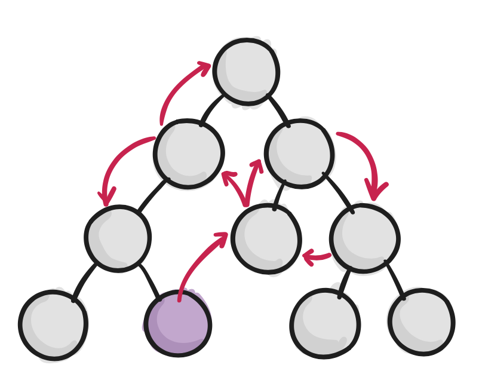{: .medium_small}


???


---
## Smart and Dumb components

* smart components have state + props
* dumb components only props (function)

???


---
## Presentational and Container Components

* ***presentational***
  * concerned with how things look
  * have state for ui things but not data
  * generally get data as props
* ***container***
  * concerned with data
  * pass data to presentational components

???
* so far we'd had both
* either can be smart or dumb
* we've not really talkeda bout this abstraction
* but will have a bit more of it soon with redux!


---
## Flux

<iframe width="853" height="480" src="https://www.youtube.com/embed/nYkdrAPrdcw?controls=0&amp;showinfo=0" frameborder="0" allowfullscreen></iframe>


???
* facebook's answer to scalability


---
## The beginning

{: .medium}


???
* multiple parts of webpage that tracked messages in different ways


---
## questionable design

{: .medium}


???
* bugs were insidious
* updating one model would need to update another
  * unread thread count
  * unread messages


---
## Chat

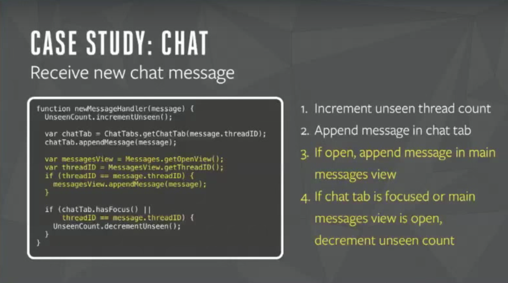{: .medium}


???


---
## Chat

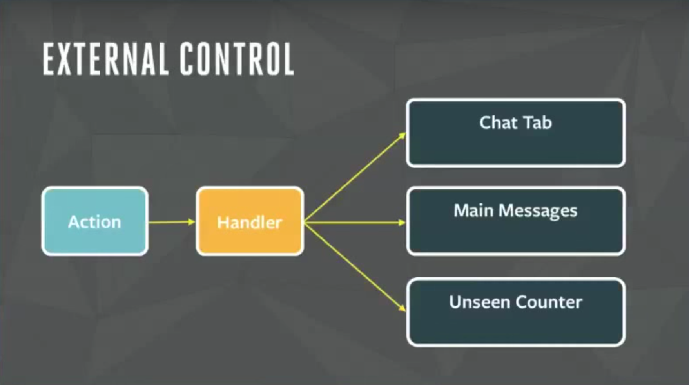{: .medium}


???


---
## MVC

{: .medium}


???
* two way binding here


---
## MVC Problems

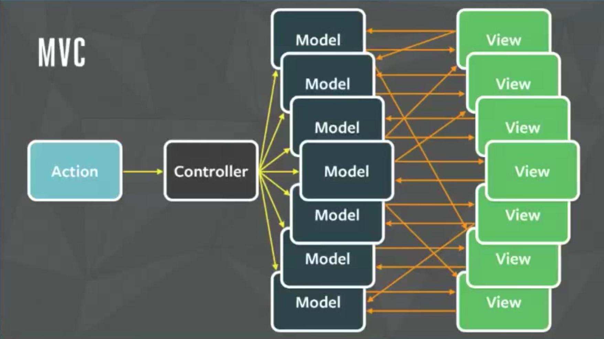{: .medium}


???
* too much stuff to keep track off
* data changing over time


---
## Enter Flux

{: }


???
* unidirectional data flow
* thanks facebook


---
## unidirectional data flow

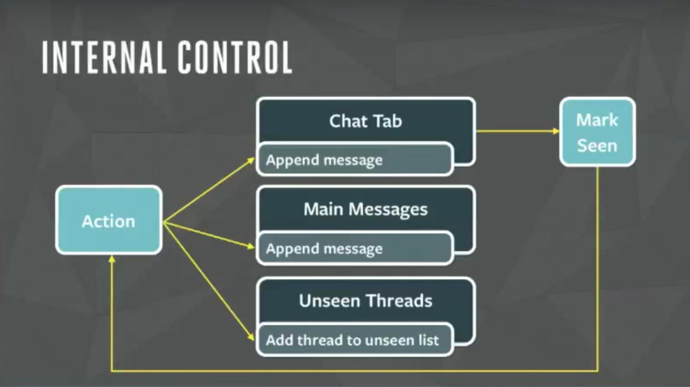{: }


???


---
## Flow Based Programming

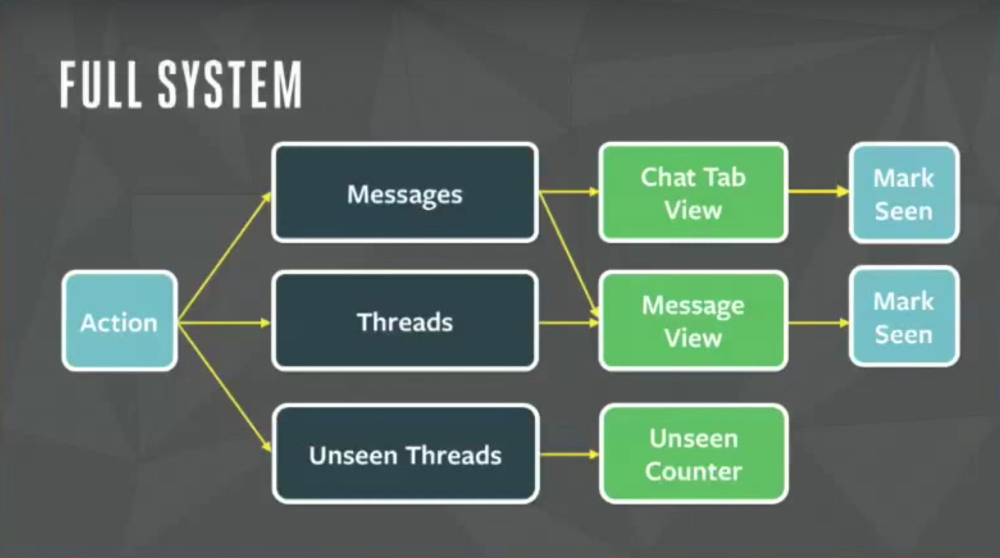{: }

???


---
## MVC -> Flux

* loosely:
  * Views -> Views (React Components)
  * Controller -> Views (Container Components)
  * Model -> Store (also ~state)


???
* we've done some of this


---

{: .hfill}


???


---


{: .white-background}


{: .small}

???
* Redux - a flux framework for the rest of us
* flux was more a paradigm
* redux takes those principles and makes them functional and awesome


---
## Application Level State

* react is great
* but could use better data management
* Redux
  * data, model, controller
  * single object stores app state!


???
* so far we'd done,  component level state vs application level state


---
## React Component Props


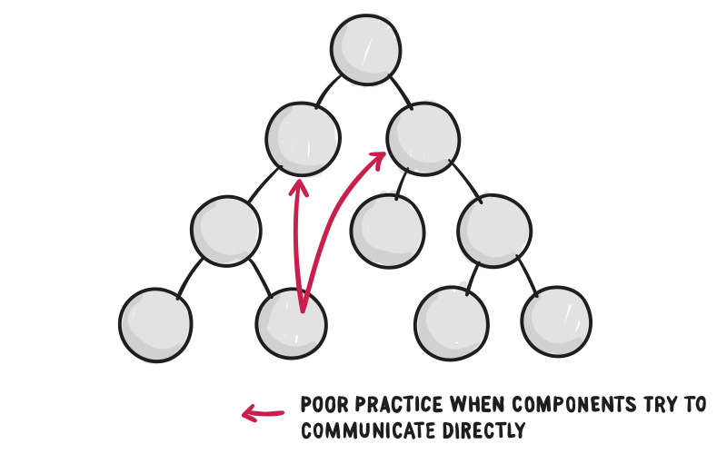{: .white-background}


???


---
## Add a dash of Redux


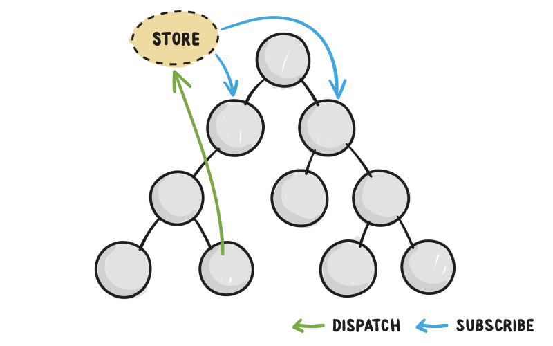{: .white-background}


???


---
## Together at Last


{: .white-background}


???


---
## State & Actions


{: .white-background}


???


---
## Multiple Reducers


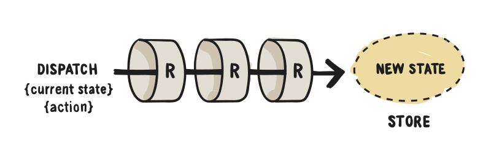{: .white-background}


???


---
## example

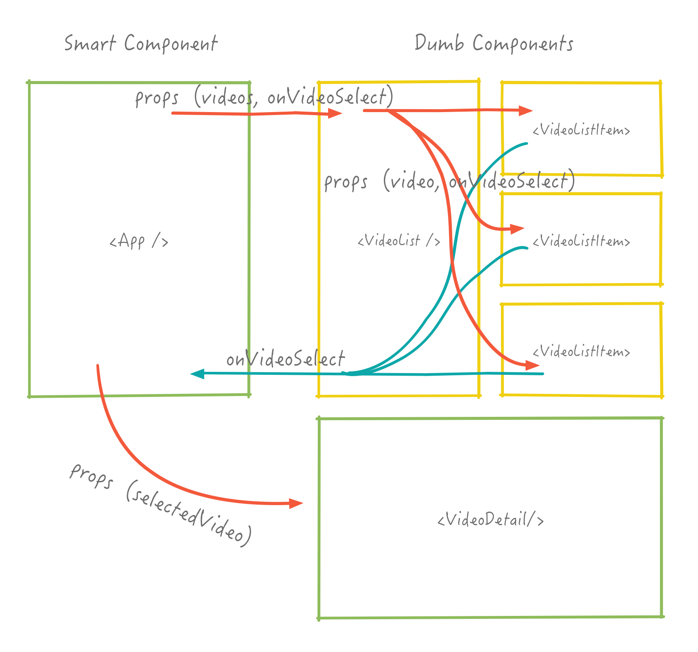{: .white-background .hfit}


???
* lets take youtube app
* had some complicated double layer wiring
* would have been nice not to pass so much stuff in props right?


---

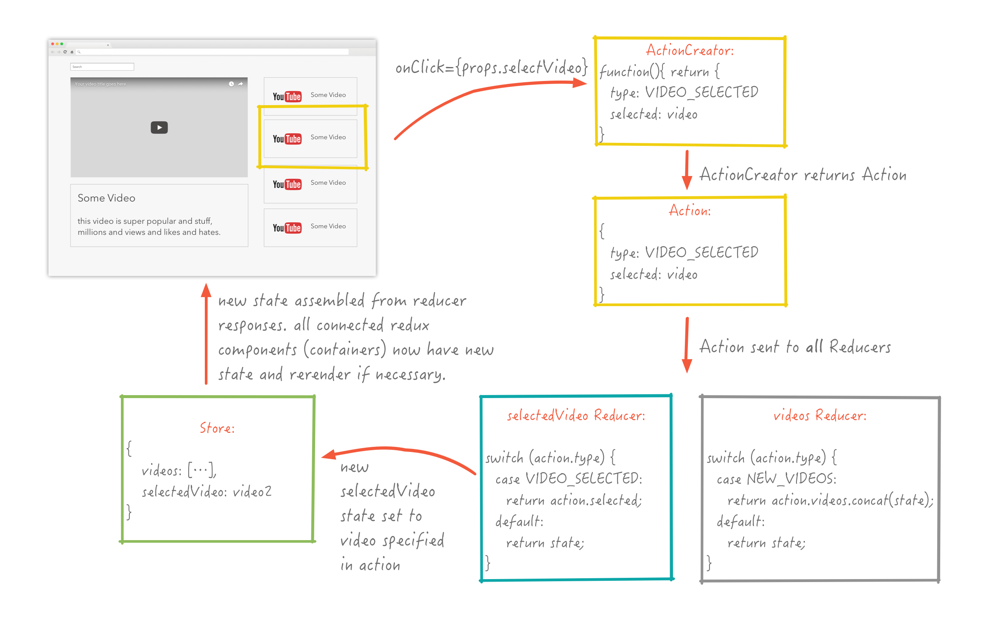{: .white-background .hfill}


???
* lets take youtube app
* had some complicated double layer wiring
* would have been nice not to pass so much stuff in props right?


---
## An Action

```javascript
{
    type: 'VIDEO_SELECTED',
    selected: video,
}
```

* is just an object
* has a type property

???
* can be constant rather than string
* all Redux events trigger actions
* remeber only way to change applicaiton state is through actions


---
## Action Creator

```javascript
export function selectVideo(video) {
  return {
    type: 'VIDEO_SELECTED',
    selected: video };
}
```

* is called in an event
  * user or ajax callback
* is a function that returns an action object
* action is sent to all reducers


???


---
##  Reducer


```javascript
export default function (state = [], action) {
  switch (action.type) {
    case 'VIDEO_SELECTED':
      return action.video;
    default:
      return state;
  }
}
```
* reducer produces new state
* based on currernt state + action
* return is assigned to key in main state


???
* we're going to use multiple reducers in most projects
* each reducer is responsible for one piece of the state object


---
## Reducers

* must be a pure function!
* receive:
  * current state
  * action and any payload
* return:
  * new state
* do not have access to anything else

???


---
##  Reducers

* all reducers get called hence `switch` on action
* return state for particular key
* must return some state, always merged
* default action return existing state

???
* REMEMBER  component state is different and can and should still be used


---
## All fine and dandy

But how do our components know about any of this?

<iframe src="//giphy.com/embed/DeKJrr8vovqXC" width="480" height="259" frameBorder="0" class="giphy-embed" allowFullScreen></iframe>

???


---
##  react-redux


<iframe src="//giphy.com/embed/O5XX68H6WfAlO" width="580" height="299" frameBorder="0" class="giphy-embed" allowFullScreen></iframe>

* no intrinsic connection
* upgrade smart objects to connected containers!

???


---
##  who needs upgrades?

* not everyone
  * components that control data
  * need to trigger actions (could use props though)
  * need access to global state
  * may pass data to presentational children components


???
* some components, presentational ones don't need it
* just props based
* no need to overuse


---
## react-redux connect

```javascript
import { connect } from 'react-redux';

class MyComponent extends Component { /* stuff */ }

export default connect(mapStateToProps,
  mapDispatchToProps)(MyComponent)
```

* higher order component!
* returns a component that is connected to redux


???


---
mapStateToProps

```javascript
  /* ... */
  render() {
    <div>{this.props.video}</div>
  }
}

const mapStateToProps = (state) => (
  {
    video: state.selectedVideo
  }
);

```
* global state -> props
* takes state as argument
* returns mapping to show up in `props`

???
* takes application state as argument
* and returns subtree that will show up as props inside the connected component
* exposes a bit of global state to this particular component


---
mapDispatchToProps

```javascript
import * as actions from './actions';

function mapDispatchToProps(dispatch) {
  return bindActionCreators({selectVideo: actions.selectVideo}, dispatch);
}

export default connect(mapStateToProps, mapDispatchToProps)(MyComponent);
//or shorthand
export default connect(mapStateToProps, {selectVideo: actions.selectVideo})(MyComponent);
// or even shorter:
export default connect(mapStateToProps, actions)(MyComponent);
```

* component must be connected to ActionCreator functions
* if called directly won't trigger reducer!
* lots of short hand [here](https://github.com/reactjs/react-redux/blob/master/docs/api.md#connectmapstatetoprops-mapdispatchtoprops-mergeprops-options)
???


---
## Provider

```html
ReactDOM.render(
  <Provider store={store}>
    <MyRootComponent />
  </Provider>,
  rootEl
)
```

* last thing, provides access to store to connected components
* required boilerplate

???


---

<iframe src="//giphy.com/embed/JjKYrKa8UVTNe" width="480" height="466" frameBorder="0" class="giphy-embed" allowFullScreen></iframe>

???
* ok that was a lot of codes
* but once you've set it up once it'll all start making sense
* remember we're learning how to build large-scale web apps


---
## devtools

{: .medium }


???
* react devtools, hopefully you've all been using this


---
## devtools

{: .medium }


???
* redux devtools give you state timemachine
* and you can just set the state, and import and export the state!


---
## Question Time


<iframe src="//giphy.com/embed/jTZVegIrdLCCY" width="480" height="360" frameBorder="0" class="giphy-embed" allowFullScreen></iframe>

???


---
## Lets try it!

[http://cs52.me/workshops/redux](http://cs52.me/workshops/redux)

???


