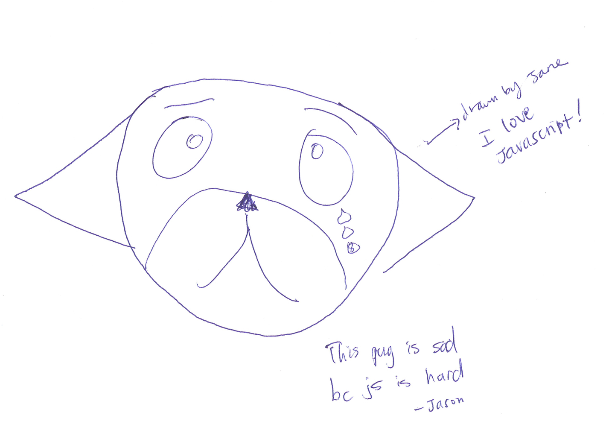

layout: true
class: center, middle
name: pic
background-size: contain

---

layout: true
class: center, top
name: fragment

.title[{{name}}]

---
layout: true
class: center, middle
name: base

.title[{{name}}]

---
name: Redux


.medium[]


---
name: CS52 Art


.medium[]


???
*

---
name: CS52 Art


.medium[]


???
*


---
name: CS52 Art

.medium[]


???
*


---
name: Quiz

<iframe src="//giphy.com/embed/BnlSxZ1nJy9C8" width=700" height="422" frameBorder="0" class="giphy-embed" allowFullScreen></iframe>

???


---
name:  Stuff

* Idea Pitches: Tuesday!
  * 2 minute pitch + some q&a
  * voting offline
* a good pitch:
  * motivation the problem
  * have a user story
  * why you and your solution

???


---
name: Course Survey Results

<iframe src="https://dalilab.typeform.com/report/ECghOO/c0YU"  width="800" height="400" frameBorder="0" ></iframe>

???
* we're a little behind the master plan, but thats ok!
* majority understanding majority of material
* stuff will start making more sense
* lots to learn, but we'll make it


---
name: Things That Were Liked

* "Everything has the "coolness" factor	"
* "awesome awesome awesome tas"
* "I feel like we're creating real, useful applications from scratch"
* "I like the short assignments and labs because they are super relevant, helpful and fun to do!	"
* "I also like doing the workshops in class because it exposes us to new technologies and provides for more hands-on learning, which, in my experience, is how must programmers I know learn best."
* "The gifs"
* "fun assignments, engaging classes	"
* "Exposure to many different technologies, labs are interesting, course team is incredibly responsive on Slack	"
* "I like how we're building on top of what we learn. Javascript -> Jquery -> React	"
* "love how much exposure we have to cool stuff on the web- and I am amazed at how just a few lines of code can have so much power."
* "One of my favorite cs courses because the atmosphere is serious yet fun	"
* great ta's! wish there were more office hours

???
* these are great, so we're doing some things right!
* sounds like you guys like the labs generally so thats good
* and the tas


---
name: Things To Improve

* "More extensions"
* "Not a huge fan of overlapping assignments"
* "Maybe have recap sessions?	"
* "I don't really feel like I'm learning much from the workshops other than just copy pasting code blocks into a skeleton -- maybe it's hard to do much more than that in an hour though.	"
* "Not much, I think it's understood that the course is fast paced	"
* "more time for labs	"
* "idk i like it"
* "the lectures are sometimes confusing. Like, when computer related jargons are used: frontend, backend, queue etc.. Once I lose track of the lecture for a bit, I end up not understanding the rest of it."
* "Doing a brief breakdown of some popular websites (e.g. Airbnb, Facebook) and discussing the tools they use and specific components would be awesome to make things more real."
* "examples of nice solutions to the short assignments and the labs, it would be really helpful to see other ways of doing these."

???
* go into react dev tools and redux dev tools on sites and explore
* workshop goal is to provide a resource and very brief exposure
* recap sessions are often what x-hour open help hours turn into - come!
* notes - additional explanations might be in the presenter notes - slides help available via h key
* more questions - if i use a term that's confusing ask via whisperbot
* companies:
  * giphy
  * facebook (obvi)
  * instagram (obvi)
  * netflix
  * khanacademy
  * airbnb  (also redux)
  * walmart
  * tesla


---
name: What do we know about React so far?

* components - smart and dumb
* unidirectional data flow
* events and callbacks
* state and props
* rendering jsx


???


---
name: Problems

.medium[]


???


---
name: Smart and Dumb components

* smart components have state + props
* dumb components only props (function)

???


---
name: Presentational and Container Components

* ***presentational***
  * concerned with how things look
  * have state for ui things but not data
  * generally get data as props
  * real view
  * reusable (your mini bootstrap)
* ***container***
  * concerned with data
  * pass data to presentational components
  * binds callbacks for dumb
  * *connected*

???
* so far we'd had both
* either can be smart or dumb
* we've not really talkeda bout this abstraction
* but will have a bit more of it soon with redux!


---
name: Flux

<iframe width="640" height="360" src="https://www.youtube.com/embed/nYkdrAPrdcw?rel=0&amp;showinfo=0" frameborder="0" allowfullscreen></iframe>

???
* facebook's answer to scalability
* interesting worth watching


---
name: The beginning


???
* multiple parts of webpage that tracked messages in different ways
* had a messenger window but also unread count


---
name: questionable design


???
* bugs were insidious
* how do you handle both staying in synch - read in one meant mark as read in another
* updating one model would need to update another
  * unread thread count
  * unread messages


---
name: Chat

.medium[]


???
* increment unseen
* append message in chat
* if open append message in messages Views
* if chat tab is focused or messages is open - decrement unseen
* complex login living in multiple places


---
name: Chat

.medium[]


???
* large amount of centralized logic is one solution but have to code for consistency problems
* perhaps storing unseen as a list by threadID would be better
* moving display logic to each component so it can decide based on data how to render (sound familiar)
* separating data from view


---
name: MVC

.medium[]


???
* two way binding here


---
name: MVC Problems

.medium[]


???
* too much stuff to keep track off
* data changing over time


---
name: Enter Flux


???
* unidirectional data flow
* thanks facebook
* predictable - no multiple arrows
* finish a layer you are done
* with multiple Views easy as arrows go in one direction
* easy to reason about


---
name: unidirectional data flow


???
* track an action through the system
* easy consistency


---
name: Flow Based Programming


???
* no backwards arrows
* can imagine testing is easy


---
name: MVC -> Flux

* loosely:
  * Views -> Views (React Components)
  * Controller -> Views (Container Components)
  * Model -> Store (also ~state)


???
* how do we convert one way of reasoning to another?


---
name:


???
* flux was a bit tricky
* dan abramov comes up with answer - REDUX


---
name:


.small[] 7/2016

.small[] 4/2017

???
* Redux - a flux framework for the rest of us
* flux was more a paradigm
* redux takes those principles and makes them functional and awesome


---
name: Application Level State

* react is great
* but could use better data management
* Redux
  * data, model, controller
  * single object stores app state!


???
* so far we'd done,  component level state vs application level state
* we've hacked components to allow us to pass down component level state
* but not ideal solution


---
name: React Component Props


???
* not ideal, why do the parents need to know for instance?


---
name: Add a dash of Redux


???
* what if we had an application level store of data
* where a component can dispatch an action
* and others can subscribe to data - NOT EVENTS BUT ACTUAL DATA


---
name: Together at Last


???


---
name: State & Actions


???
* dispatch sends actions to reducers which return new state given old state


---
name: Multiple Reducers


???
* lets dance


---
name: In motion

.medium[]


???
* and here's how it all moves Together
* state comes in together with action to form new state


---
name: example

.medium[]


???
* lets take youtube app
* had some complicated double layer wiring
* would have been nice not to pass so much stuff in props right?


---
name: example+redux


???
* lets take youtube app
* had some complicated double layer wiring
* would have been nice not to pass so much stuff in props right?


---
name: Thunks

.medium[]

* what about asynch stuff like api calls?!?!

???
* in CS a thunk is a method that is created, often automatically, to assist a call to another method.
* what if we need to make an api call that takes time
* there a way we can fix that also
* we'll work with these in SA6


---
name: An Action

```javascript
{
    type: 'VIDEO_SELECTED',
    selected: video,
}
```

* is just an object
* has a type property

???
* can be constant rather than string
* all Redux events trigger actions
* remeber only way to change applicaiton state is through actions


---
name: Action Creator

```javascript
export function selectVideo(video) {
  return {
    type: 'VIDEO_SELECTED',
    selected: video };
  }
}
```

* is called in an event
  * user or ajax callback
* is a function that returns an action object
* action is sent to all reducers


???


---
name:  Reducer


```javascript
export default function (state = [], action) {
  switch (action.type) {
    case 'VIDEO_SELECTED':
      return action.video;
    default:
      return state;
  }
}
```
* reducer produces new state
* based on currernt state + action
* return is assigned to key in main state


???
* we're going to use multiple reducers in most projects
* each reducer is responsible for one piece of the state object


---
name: Reducers

* must be a pure function!
* receive:
  * current state
  * action and any payload
* return:
  * new state
* do not have access to anything else

???


---
name:  Reducers

* all reducers get called hence `switch` on action
* return state for particular key
* must return some state, always merged
* default action return existing state

???
* REMEMBER  component state is different and can and should still be used


---
name: All fine and dandy

But how do our components know about any of this?

<iframe src="//giphy.com/embed/DeKJrr8vovqXC" width="480" height="259" frameBorder="0" class="giphy-embed" allowFullScreen></iframe>

???


---
name:  react-redux


<iframe src="//giphy.com/embed/O5XX68H6WfAlO" width="580" height="299" frameBorder="0" class="giphy-embed" allowFullScreen></iframe>

* no intrinsic connection
* upgrade smart objects to connected containers!

???


---
name:  who needs upgrades?

* not everyone
  * components that control data
  * need to trigger actions (could use props though)
  * need access to global state
  * may pass data to presentational children components


???
* some components, presentational ones don't need it
* just props based
* no need to overuse


---
name: react-redux connect

```javascript
import { connect } from 'react-redux';

class MyComponent extends Component { /* stuff */ }

export default connect(mapStateToProps,
  mapDispatchToProps)(MyComponent)
```

* higher order component!
* returns a component that is connected to redux


???


---
name: mapStateToProps

```javascript
  /* ... */
  render() {
    <div>{this.props.video}</div>
  }
}

const mapStateToProps = (state) => (
  {
    video: state.selectedVideo
  }
);

```
* global state -> props
* takes state as argument
* returns mapping to show up in `props`

???
* takes application state as argument
* and returns subtree that will show up as props inside the connected component
* exposes a bit of global state to this particular component


---
name: mapDispatchToProps

```javascript
import * as actions from './actions';

function mapDispatchToProps(dispatch) {
  return bindActionCreators({selectVideo: actions.selectVideo}, dispatch);
}

export default connect(mapStateToProps, mapDispatchToProps)(MyComponent);
//or shorthand
export default connect(mapStateToProps, {selectVideo: actions.selectVideo})(MyComponent);
// or even shorter:
export default connect(mapStateToProps, actions)(MyComponent);
```

* component must be connected to ActionCreator functions
* if called directly won't trigger reducer!
* lots of short hand [here](https://github.com/reactjs/react-redux/blob/master/docs/api.md#connectmapstatetoprops-mapdispatchtoprops-mergeprops-options)
???


---
name: Provider

.left[]
.right[

```html
ReactDOM.render(
  <Provider store={store}>
    <MyRootComponent />
  </Provider>,
  rootEl
)
```
]


???
* last thing, provides access to store to connected components
* required boilerplate


---
name:


<iframe src="//giphy.com/embed/JjKYrKa8UVTNe" width="480" height="466" frameBorder="0" class="giphy-embed" allowFullScreen></iframe>

???
* ok that was a lot of codes
* but once you've set it up once it'll all start making sense
* remember we're learning how to build large-scale web apps


---
name: devtools

.medium[]


???
* react devtools, hopefully you've all been using this


---
name: devtools

.medium[]


???
* redux devtools give you state timemachine
* and you can just set the state, and import and export the state!


---
name: Question Time


<iframe src="//giphy.com/embed/jTZVegIrdLCCY" width="480" height="360" frameBorder="0" class="giphy-embed" allowFullScreen></iframe>

???
