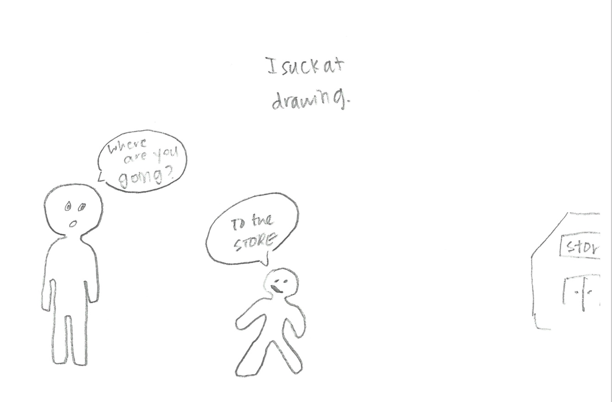

layout: true
class: center, middle
name: pic
background-size: contain

---

layout: true
class: center, top
name: fragment

.title[{{name}}]

---
layout: true
class: center, middle
name: base

.title[{{name}}]


---
name: Today

* Workshop
* Pitches

???


---
name: CS52 Art


---
name:


```js
function renderStuff() {
   this.state.notes.entrySeq().map( ([id, note]) => {
       return <Note  id={id} note={note} />;
   });
}
```


---
name: CS52 Art


???
*


---
name: functions


```js
const subscribe = (callback) => {
     database.ref('notes').on('value', (snapshot) => {
      callback(snapshot);
    });
}
```


---
name: functions


```javascript
class Foo {
   constructor() {
       this.state = {values: {}, txt: ‘’}
       this.update = this.update.bind(this);
       subscribe( values => {this.setState({values})});
   }

   update(txt) { this.setState({txt});  }

   render() {
      <Bar change={ t => this.update(t)}
           handleSubmit={ () => console.log(‘done’); }
   }
}
```

---
name: functions


```js
const Bar = (props) => {
    return (
       <form onSubmit={props.handleSubmit}>
          <input onChange={e => props.change(e.target.value)} />
       </form>
    )
}
```


---
name: es6 class syntax EC


```js
class Foo extends Component{
  constructor(props) {
    super(props);
  }
}
```

```js
// what babel does
var Foo = function (_Component) {
  _inherits(Foo, _Component);

  function Foo(props) {
    _classCallCheck(this, Foo);

    return _possibleConstructorReturn(this, Foo.__proto__);
  }

  return Foo;
}(Component);
```


---
name: CS52 Art


.medium_small[]


???
*


---
name: problems

Given:

```js
<Hello name={this.state.name} onInputChange={this.nameChange} />
```


```js
class Hello extends Component {
  constructor(props) {
    super(props);
    this.state={name: this.props.name};
  }
  onInputChange(event){
    this.setState(event.target.value);
  }
  render() {
    return <input onChange={this.onInputChange}
           value={this.props.name} />
  }
}
```


???
* can rewrite


---
name: CS52 Art


.medium[]


???
*
