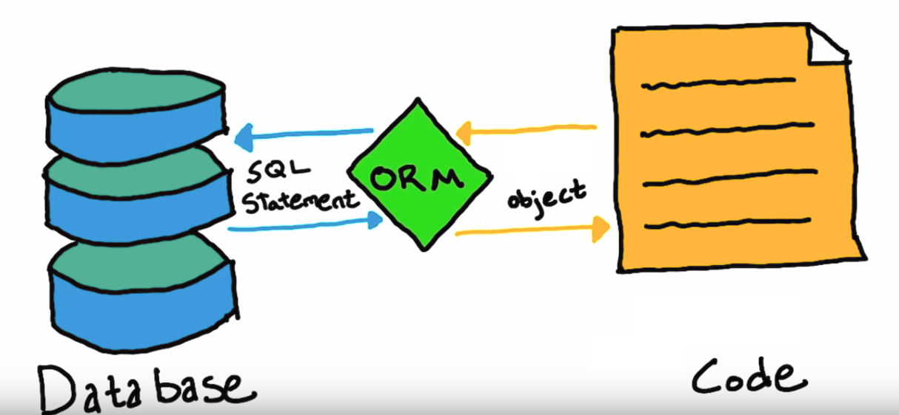

layout: true
class: center, middle
name: pic
background-size: contain

---

layout: true
class: center, top
name: fragment

.title[{{name}}]

---
layout: true
class: center, middle
name: base

.title[{{name}}]

---
name: Today and Stuff

.left[
]

.right[
* Serverside finally!
* Databases
* SA7
]

???
* take or taking cs61


<!-- name: CS52 Art


 -->


<!--  -->


<!-- name:  whew, well that was fun

* no quizes ever, already too much
* up next: sa7, lab5p1 - will discuss -->

<!-- name: Final Project Ideas

<iframe width="600" height="400" src="https://www.youtube.com/embed/J-GVd_HLlps?rel=0&amp;showinfo=0" frameborder="0" allowfullscreen></iframe>

* Thoughts on pitching
* Ideas+ -->


<!-- name: Story

<iframe src="https://giphy.com/embed/IoQETeY2ue5bi" width="308" height="360" frameBorder="0" class="giphy-embed" allowFullScreen></iframe>

* What is the problem?
  * Story hook / why it matters?
* What are you doing / your solution?
* How are you special?
* Next step? -->


<!-- name: Ok but like, why?

<iframe src="https://giphy.com/embed/113udJYmASs3qE" width="480" height="282" frameBorder="0" class="giphy-embed" allowFullScreen></iframe>

???
* get roommate to cleanup
* go on a date
* get a job
* anytime present what you care about
* we'll start tomorrow!  I'
 -->


<!-- name: Your Pitch

* Propose either:
    * problem with a potential solution
    * OR pose a problem you want to attempt to solve without a solution
    * OR a topic that you think might be interesting to brainstorm around

* tmrw and thurs


* dont' overdefine
* but also who wouldn't want to be on a project with someone passionate? -->


---
name: What Is REST API?


.medium[]

* <span style="color: #F27D00">RE</span>presentational <span style="color: #F27D00">S</span>tate <span style="color: #F27D00">T</span>ransfer
  * software architecture style
  * guidelines for web app to server communications

???
* what we used for bloggy
* transfer some state -> from remote server to client
* where state is data from server
* api -> application programming interface on the web
* following some guidlines


---
name:  RESTful API


* Server should export resources to clients using unique names (URIs)
  * http://api.domain.com/photo/ is a collection
  * http://api.domain.com/photo/48s9c8s83j is a resource
* Server supports a set of HTTP verb mapping to CRUD

???
* resources avaible via http
* in file like paths
* helps to organize and think in terms of **paths to resources** rather than actions or functions
* why is this bad?


---
name:  RESTful API

.medium[]


* Server supports a set of HTTP verbs mapping to CRUD
  * *GET* method - Read resource (list on collection)
  * *PUT* method - Update resource
  * *POST* method - Create resource
  * *DELETE* method - Delete resource
* **do**: PUT `api.com/posts/:id`
* **don't**: POST `api.com/updatePostByID`


???
* endpoints are resources not actions
* why would it be bad to have action endpoints?
   * have hundreds potentially
   * getUser, getUserProfile, getListViewAuthorized, etc


---
name: API Design

.medium[]


1. define resources, give them unique names (URIs)
1. clients use CRUD operations via HTTP methods
1. keep abstractions clean: GET's don't delete, etc

???


---
name: RESTful API


* Control caching of resources
* Keep servers "stateless"

???
* why is stateless good?
  * load balancing across web servers
* easier to cache resource than actions


---
name: Standard

* proposed in phd thesis circa 2000
* been standard for years
* used everywhere

???
* gotta know it


---
name:


<iframe src="//giphy.com/embed/3oEduRCITWQ5BruE8g" width="780" height="499" frameBorder="0" class="giphy-embed" allowFullScreen></iframe>

???
* but there are problems
* what are some problems we ran into with blog?
  * updates?
  * how would you do chat?


---
name: Complications

* complicated data requires multiple round trips to server
* versioning with old clients breaking
* variability in REST design
* data returned may not be what exactly what is needed
* realtime?

???
* content not returned for posts? 
* image size? 
* posts have a userid - but don't know who that is?
* have to think about versioning


---
name: One Solution

.medium[]

* GraphQL
  * query "shape" determines response
  * multiple data stores


???
* is out now
* one of the workshops coming up is on this


---
name: GraphQL

.left-small[
```js
//QUERY
{
  article(id: '2k3k3') {
    id
    title
    image(width: 600) {
      src
    }
  }
}
```
]


.right-large[
```json
//RESPONSE
{
  "article": {
    "id": "2k3k3",
    "title": "Welcome to GraphQL",
    "image": {
      "src": "http:///..."
    }
  }
}
```
]


???
* cool, but still a bit complicated to design and use - 99% of apis are REST
* function like query part
* helps with getting the data you need
* btws, if you read that redux is dead - it isn't, you still have the same frontend how to deal with complex data problem
* you still want to manage your state in a smart way


---
name: Websockets!

.medium[]

* firebase like subscriptions to data (websockets EC SA)
* good for realtime
* not so good for complicated data

???
* less structured
* we'll use websockets in EC: SA8
* more on this later


---
name: Lab 5

.medium[]

* be RESTful with expressjs
* routes
* HTTP verbs
* JSON responses

???
* expressjs is a lightweight web framework on the server-side
* webpack-dev-server is actually built on express


---
name: Storage

<iframe src="//giphy.com/embed/N35rW3vRNeaDC" width="580" height="475" frameBorder="0" class="giphy-embed" allowFullScreen></iframe>

???
* how to store data in a manageable way
* need to persist data to server


---
name: Storage

.left-small[
* Need to persist data
* central storage
* options:
  * piles
  * files
  * tables
  * documents
]

.right-large[
<iframe src="//giphy.com/embed/aHmquP8GsDCHS?hideSocial=true" width="380" height="380" frameBorder="0" class="giphy-embed" allowFullScreen></iframe>
]

???
* piles, files, tables, documents
* need this to be remotely accessible
* need it to be fast
* structured maybe?
* need to be able to query
* ask specific questions
* btw piles are a real thing - double ended priority queues - added to either end, if needs middle then new pile is started.


---
name: Database Systems

<iframe src="//giphy.com/embed/xTiTnxpQ3ghPiB2Hp6?hideSocial=true" width="480" height="269.76" frameBorder="0" class="giphy-embed" allowFullScreen></iframe>

* nothing like ☝️
* run on server (or dev machine)
* connect to database via library
* queries are code -> fetch or change data
* **no direct connections from client side code**

???
* are a process typically that runs on some machine
* queries to ask the system specific questions
* server talks to database not client
* let's talk briefly about some options so you can choose db systems that fit your need


---
name: Relational Database


.left-small[
* series of tables
  * rows and columns
* connected by relations
* columns are typed:
  * string, int, etc
]

.right-large[

]

???
* excel pivot table


---
name: RDBMS

.small[]


* replication
* fault tolerance
* complex queries and optimizations

???
* excel pivot table
* relational database management Systems


---
name: ACID

.small[]

* atomicity
* consistency
* isolation
* durability

???
* atomicity:  each transaction is all or nothing. (update both inventory and available credit)
* consistency:  valid states of database by some rules. (non-negative inventory)
* isolation:  steps in transactions don't affect other transactions. (can't interleave transaction components).
* durability:  committed data never lost
* also this is vitamin c


---
name: Schema

.small[]


* structure of the database
* tables, columns and types
* any additional constraints

???
* describes the structure of the db
* this image is of a mental schema not a database schema. some cognition theories think our brain stores objects with schemas for recognition


---
name: Example Schema

```javascript
{
    id: Number,
    name: String,
    email: String,
    birthday: Date,
    comments: [ID]
}
```

???
* each column has a type
* can define more things


---
name: SQL

.small[]

```python
connection_string = ('SERVER=localhost;','DATABASE=mydb;')
connection = pyodbc.connect(connection_string)
cursor = connection.cursor()

cmd = 'select * from tbl where name={name}'.format(name)
cursor.execute(cmd)

for result in cursor.fetchAll():
   print(result)
```

* Structured Query Language
  * relational algebra
  * complex queries
  * table joins
  * transactions

???
* language to describe questions / operations to perform on the DB
* database runs on server or you local machine!
* query is in code that talks to server, not HTTP
* this is server side, you would not connect to database directly from the web


---
name: Relational Algebra

.medium[]

.medium[]

```sql
SELECT *
FROM Employee
JOIN Dept
ON Employee.DeptName=dept.DeptName;
```

???
* set operations, unions, intersections etc
* right out join, left inner join
* won't be needing this in this class
* **natural join - all columns are kept from both but only where matching key**
* btw - when i first proposed this course had a full week on databases and curriculum committee laughed

---
name: JOINS

.medium[]


???
* left/right: keeping rows of one side even if don't have matching keys in other for instance
* generally full join or inner join are useful
* oof


---
name: Keys and Indexes

```sql
SELECT * FROM Users WHERE id = 2
```

* scan through rows if not keys (inefficient!)
* lookup result from index instead
* index maps:
  * value as hashkey to row
  * lookup table $O(1)$
  * or $O(log(n))$
* **primary key**: unique row ID
* **secondary keys**: other columns
* **foreign keys**: refer to unique ids of other tables


???
* cranking through rows is slow
* hashmap
* secondary keys *can* be set on other columns
* foreign keys are for relationship lookups
* each row/object has at least 1 unique identifier


---
name: Object vs Table


<iframe src="//giphy.com/embed/BfqcuxcIAUGVa" width="305" height="520" frameBorder="0" class="giphy-embed" allowFullScreen></iframe>

???
* object vs table
* but we're programmers, we just want objects everywhere.
* don't care about columns and such.
* cat object, has property claws and allergens


---
name: In practice: ORM

.fancy.small[]

* Object Relational Mapping
  * Objects map to database records
  * A class for each table
  * Objects of class are rows
  * Attributes are columns
* less sql the better

???
* dealing with SQL syntax is hard
* we can add abstraction layer!
* we like objects better
* also provides sanitization


---
name: Objects Queries vs SQL

```python
cmd = 'select * from User where name={name}'.format(name)
cursor.execute(cmd)
```

* vs

```js
User.find({name})
```

* what if?
  * `name = '; update User set role="admin" where name="tim"'`
  * sql injection for lunch anyone?

???
* ORM's greatly simplified dealing with sql
* ActiveRecord was Ruby On Rails big win
* what if we just stored objects in the database like we want
* make live easier for developers
* AND more secure
* ; ends line


---
name: Little Bobby Tables

.large[]


---
name: NoSQL

* what if we just stored objects / documents directly?!

<iframe src="//giphy.com/embed/pHJHblYwlIptC" width="480" height="382" frameBorder="0" class="giphy-embed" allowFullScreen></iframe>

???
* sure we can do that!


---
name: NoSQL

.medium[]


* key:value stores
* graphs
* documents

???
* different pros and cons
* documents are what we are going to be talking about
* mongodb
* no sql vs not only sql
* some are specialized storage for different purposes


---
name: MongoDB

.small[]


* Data model:
  * collections of documents (JSON)
* expressive query language
* supports indexes
* tries for scalability

???
* mongodb has supporters and haters
* largely just need to understand limitations
* and use appropriately
* when first came out people misused and misunderstood leading to data loss and hate
* tassel used postgres for 2 terms but this term rewrote entire backend back to mongo. 

---
name: mongodb

.small[]

???
* more coolaid - mongo is cool
* sure it doesn't provide as many guarantees, but you may not need them

---
name: Freeform JSON

.small[]

```js
users = [
  {id:1, name: 'Captain Marvel', posts: [3,4]},
  {id:2, full_name: 'Jeannie Leavitt', callsign: 'Tally', posts: [1,2], birthday: '1967', },
]
```

* with great flexibility comes great responsibility
* unstructured data up to dev to enforce structure

???
* up to you to make it work
* background jobs etc
* make sure to rollback if a chain of queries fails


---
name: Need to Know

.small[]

.left[
* ACID vs BASE
  * Basically Available
  * Scalable
  * Eventually Consistent
]

.right[
* NOSQL != ACID
  * programmer managed
  * transactions more complicated
  * data duplication
  * eventual consistency
]


???
* newish support for packaging up transactions
* different use case
* basically available: availability more important than consistency
* scalable:  fast and simple
* eventually consistent:  duplicate data ok, no complex ops like joins
* acid:
  * atomicity
  * consistency
  * isolation
  * durability


---
name: Eventually Consistent


```js
post: {
  PostID,
  FullName, //duplicated
  AuthorID,
  Title,
  Content
}
author: {
  AuthorID,
  FullName,
  Email,
  Birthday
}
```

???
* data eventual consistency
* but also across servers sometimes
* facebook example, cassandra as store


---
name: Tools for the Programmer

* what if we wanted help with schema enforcement?

???
* we had ORM's for sql is that a thing?


---
name: Mongoose

.medium[]

* Object Definition Language
* Like an ORM but for Mongo
* You thought documents were already friendly?  

???
* ODL


---
name: Mongoose Schema

* Types:
  * String, Number, Date, Buffer, Boolean
  * Array: []
  * ObjectId: references to other documents (relation)
  * and nested objects {}

```javascript
const userSchema = new mongoose.Schema({
  name: String,
  birthday: Date,
  posts: [ObjectId]
});
```

???
* schema defines the documents in a collection


---
name: Index and More

```js
// secondary indices
// in field definition
email: {type: 'String', index: {unique: true}}

//or schema
userSchema.index({ name: 1, birthday: -1 });
```

```js
// date type
date: {type: Date, default: Date.now }
```

```js
// virtuals are computed fields
personSchema.virtual('fullName').get(function () {
  return this.first_name + ' ' + this.last_name;
});
```


???
* secondary indexes
* some data rules
* virtual fields (computed)


---
name:


.small[]

* pros
  * faster queries
  * no scanning
* cons:
  * mutating ops like update, add, delete slightly slower
  * storage space (need to fit into RAM)
* use indexes for common queries


---
name: Mongoose Model

* fancy constructors compiled from Schema
  * instances represent documents
  * new documents
  * query documents

```javascript
const User = mongoose.model('User', userSchema);

User.create({ first_name: 'Remus', last_name: 'Lupin'})

User.findOne({_id: user_id})
  .then(user => {
    user.location = [51.528308,-0.3817765];
    return user.save();
  });

User.remove({first_name: 'Remus', last_name: 'Lupin'});
```


???


---
name: SA7

.medium[]

* build expressjs routes
* return server side rendered html
* use mongoDB for data persistence
* use mongoose for *ORM*

???
* we'll take a short break from redux and react!
* build a server side rendered app
* anyone remember what server rendered is?


---
name: SA7


