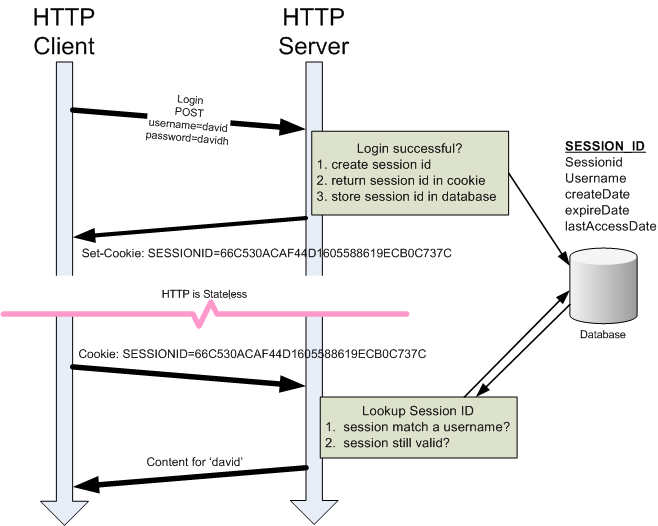
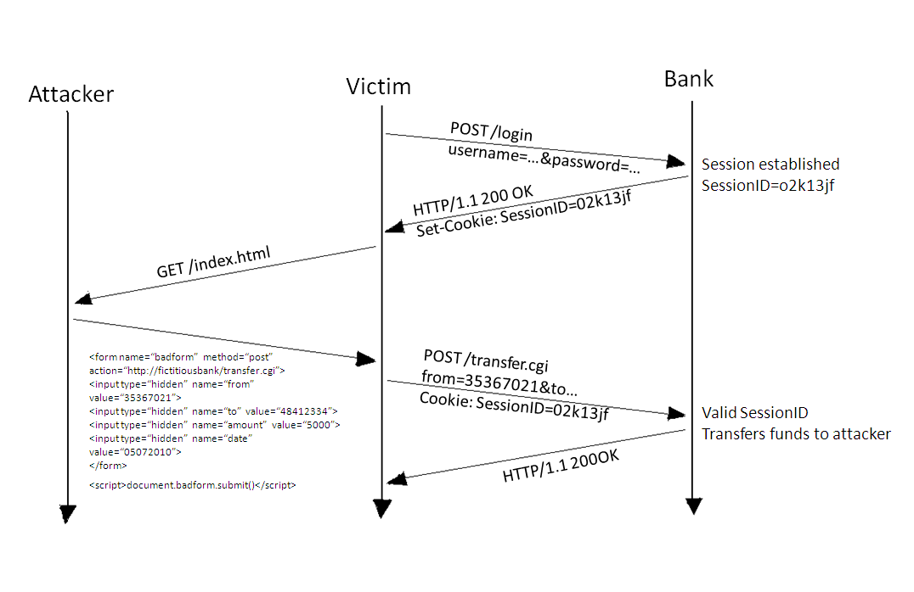
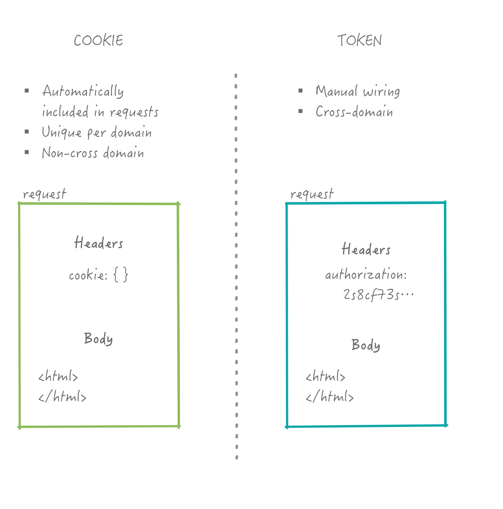
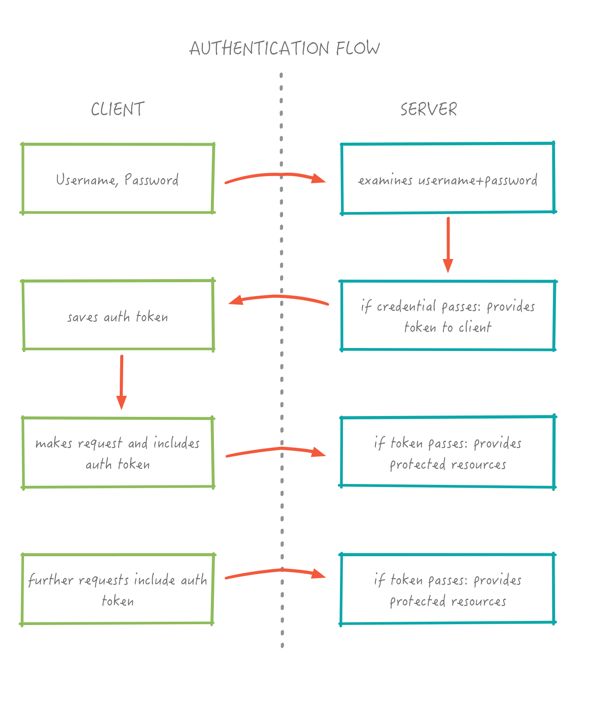
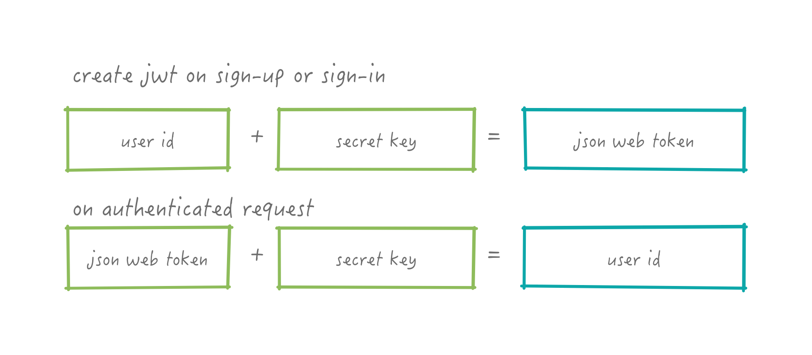
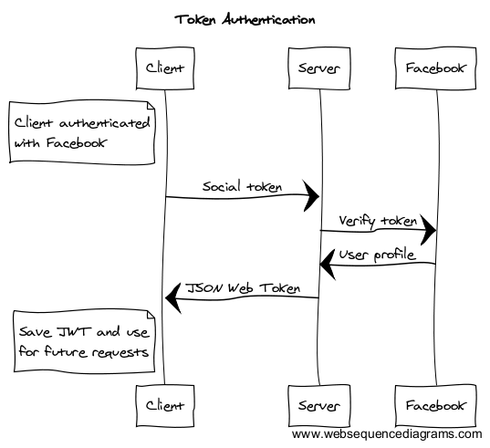

layout: true
class: center, middle
name: pic
background-size: contain

---

layout: true
class: center, top
name: fragment

.title[{{name}}]

---
layout: true
class: center, middle
name: base

.title[{{name}}]


---
name: Today

* Sessions
* Authentication
* X-hour tomorrow!
* Teams released, milestones discussed during xhour!

???
* quiz tomorrow


---
name: Sessions

<iframe src="//giphy.com/embed/ukE9oP3kb7TVu" width="480" height="203" frameBorder="0" class="giphy-embed" allowFullScreen></iframe>

* state between each request to server
* who is logged in?
* what have they done?

???
* stateless http
* so far we've had in memory storage
* and we've had database storage
* but nothing about connecting client-server


---
name: Browser State Persistence

.small[]


* what about after closing browser window?

???
* all browser


---
name: Session State

<iframe src="//giphy.com/embed/3hmmVGaDaFMdy" width="480" height="202" frameBorder="0" class="giphy-embed" allowFullScreen></iframe>

* keep some state in active browser
* and between browser sessions

???
* what we want to do


---
name: More State Storage

* store data:
  * client
  * web server
  * database

???
* where to store some session data?


---
name: Stateless HTTP

* HTTP request to server
  * how to identify?

???
* need to tell server who we are
* every request


---
name: Cookies

.large[]


???


---
name: Cookies

.small[]


* since early days of http:
  * some state set by web server
  * browser attaches to every request
  * key: value pairs
  * domain: server, port (optional), URL prefix (optional)
* limitations still
  * data size < 4kb
  * limited total number per domain

???
* comes from unix magic-cookie
* which comes from fortune-cookie
* a cookie with a message


---
name: Cookies

```html
// server
HTTP/1.0 200 OK
Content-type: text/html
Set-Cookie: cookie_name2=cookie_value2; expires=Sun, 16 Jul 2016 06:23:41 GM
```

```html
// browser cookie header
GET /index.html HTTP/1.1
Host: www.example.org
Cookie: cookie_name1=cookie_value1; cookie_name=cookie_value2;
```

???
* server sends cookie, client remembers it
* client sends cookie automatically back with each request
* browser and server thing - not part of http specifically


---
name: Just a file

* View cookies
* Modify/corrupt cookies
* Delete cookies
* Create cookies
* Can be stolen

???
* user id in cookie
* could be changed!


---
name: Variety of Types


.left[
* session cookie (memory)
* persistent cookie (disk)
* secure (over https)
* HttpOnly (no js)
* 3d party (ads)
* zombie (resurrects)
]

.right[
]

???
* zombie cookie is stored in a variety of different ways,  cached image in your browser, session storage, flash, etc, ip addr etc.

---
name: Tracked and Stolen

<iframe src="//giphy.com/embed/N4ZMex19Ju3XG" width="480" height="438" frameBorder="0" class="giphy-embed" allowFullScreen></iframe>

???
* cookies can be used to track you
* say you have an iframe and it loads foo.com
  * this can now drop a cookie for domain foo.com
  * but the iframe had some identifier that it was being shown on site y.com
  * now every time you go to some site that also uses the advertising provider
  * they know you've been there.


---
name: HTML5 WebStorage API

* sessionStorage
  * per origin, per window
  * only while window is open
  * survives reloads but not closes

```javascript
// Save data to sessionStorage
sessionStorage.setItem('key', 'value');
// Get saved data from sessionStorage
const data = sessionStorage.getItem('key');
// Remove saved data from sessionStorage
sessionStorage.removeItem('key')
```


???
* so maybe cookies have problems
* and we don't have enough control
* but we like javascript everything now right?
* accessed only thorugh javascripty
* still per origin - can't read another domains storage


---
name: HTML5 WebStorage API

* localStorage
  * longer term per origin storage
  * 10mb
  * accessible from JS
  * not automatic

```javascript
localStorage.someSetting = 'orange';
```


???


---
name: Framework Sessions

* Rails:
  * session[:user_id] = "pusheen"
  * cookie exists: get session data
  * otherwise: start new session
* manual encryption if any

???
* some frameworks automatically set on client and returned
* typically no encryption but easy
* typically use cookies


---
name: Additional Server Session Storage

* memory:
  * fast
  * expensive
  * can't load balance
* database
  * scalable
  * excessive
* specialized
  * *memcached*, *redis*
  * fast key:value stores

???
* frameworks might employ additinal server session tracking
* server tracking of sessions
* still requires client data but can extend local session storage


---
name: Express.js Sessions

* `request.session` through middlewares
* we'll write our own that is more secure!

???
* is cookies based


---
name: Session Hijacking

<iframe src="https://giphy.com/embed/13w1iy7dhKR40o" width="480" height="249" frameBorder="0" class="giphy-embed" allowFullScreen></iframe>

```html
// real bad
Cookie: user.password='this is my plain text password'

// still problematic
Cookie: connect.sid=2398sf98792874hk2kjh23iu
```
* security through obscurity

???
* what should we store in a cookie?
* if this could be guessed or stolen
* then attacker could easily become you
* **predictable session ids**
* security through obscurity?


---
name: HTTPS

<iframe src="https://giphy.com/embed/kTEqpBl5W9X2w" width="480" height="357" frameBorder="0" class="giphy-embed" allowFullScreen></iframe>

* even with good session id
* traffic can be monitored if not over HTTPS

???
* internet cafe wifi


---
name: CSRF

.medium_small[]


* cross site request forgery
  1. visit bank site and get session cookie
  1. later visit bad site
  1. bad site submits a form on your behalf to bank
  1. since session still valid...
  1. successful hacker funds transfer

???
* these days such an attack is rarer but still needs to be protected against
* cookies... are problematic because of the automatic include


---
name: CSRF

* many solutions
  * use secret form fields
  * use javascript to post JSON rather than forms
  * don't use cookies

???
* these days such an attack is rarer but still needs to be protected against
* cookies... are problematic because of the automatic include
* secret form fields with extra data for validation


---
name: Authentication

<iframe src="//giphy.com/embed/X68QCGb5qx596" width="680" height="470" frameBorder="0" class="giphy-embed" allowFullScreen></iframe>

???
* big topic
* hw5 is about auth
* auth isn't just about users but also about roles and permissions


---
name: username and passwords

* passwords still pretty much defacto
* 2 factor authentication on the rise

???
* 2 factor typically now is key sent to phone


---
name: How to store password


???
* as a user you might store password on **sticky note**
* computer should do better
* generate random salt
* hash the password (where a hash is a one way crytographic function)
* store salt + hash
* no way to decrypt password
* on login compare hashes
* salt helps add some randomness so that an attacker couldn't do an easier lookup of hash to password -  would have to try all possibilities for the salt.


---
name: But browser

* once authenticated how to stay authenticated

<iframe src="//giphy.com/embed/26BROFLJSFhP0cMGk" width="680" height="440" frameBorder="0" class="giphy-embed" allowFullScreen></iframe>

???
* probably need to send back something to include in future requests
* dont' want to send password over and over / store password locally?


---
name: What to send back?

* but stateless?
* once auth'd
   * give back identifying bit of data
   * need to include that data on every request

???
* wee could just say, yup authenticated; return true
* but then next request is unauthenticated again?
* need to send back some proof


---
name: Tokens Over Cookies

.medium[]

* can authenticate to another domain
* allows API

???
* cookies have problems
* and we are all js anyway
* separate servers for static and api
* multiple domains responsible for site


---
name: Tokens Over Cookies

.medium[]


???
* token:
  * manual wiring
  * cross-domain
* cookie:
  * automatically included
  * unique per domain
  * don't work across


---
name: Cookie

.medium[]

???
* included automatically


---
name: Token

.medium[]

???
* multi server support
* just need to include token for validation (stored salt+password == stored hash)


---
name: Auth Flow

.medium_small[]


???
* more auth flow


---
name: Tokens


???
* what should this token thing be?


---
name: JWT

.small[]

* JSON Web Token: [jwt.io](http://jwt.io)
* a bit of encrypted JSON
  * header: type of token and hash algo
  * payload: some fields like userid or email
  * signature:
    `hash(
      header +
      payload,
      secret)`


???
* is tricksy little bit
* signature is the tricksy bit
  * server side we take the header and payload and hash them with a secret key (known only on server)
  * on return we do the same and make sure the signature matches
  * if not deauth!
  * can force signout by changing secret key


---
name: JWT Contents



???
* what should be inside the JWT
* how about userid?


---
name: JWT Process


???
* if we are reading the userid from jwt how can we be certain it wasn't changed?
* it is after all just some JSON
* clue: signature
* what is in signature?
* clue: header+payload one way hashed with secret


---
name: Sign-in Sign-up


???


---
name: Social -> JWT Login

.medium[]

???
* social is a little tricker
* once user is logged in with fb on Frontend
* send to backend which needs to validate with FB
* then uses the fbid to either signin/signup and return jwt
* jwt then works for some extended period of time without need to reauth to FB


---
name: Tokens -> Access

<iframe src="//giphy.com/embed/Zg4Lf6cO8Cm6A" width="780" height="570" frameBorder="0" class="giphy-embed" allowFullScreen></iframe>

???


---
name:  

<iframe src="https://giphy.com/embed/12OIWdzFhisgww" width="480" height="270" frameBorder="0" class="giphy-embed" allowFullScreen></iframe>
