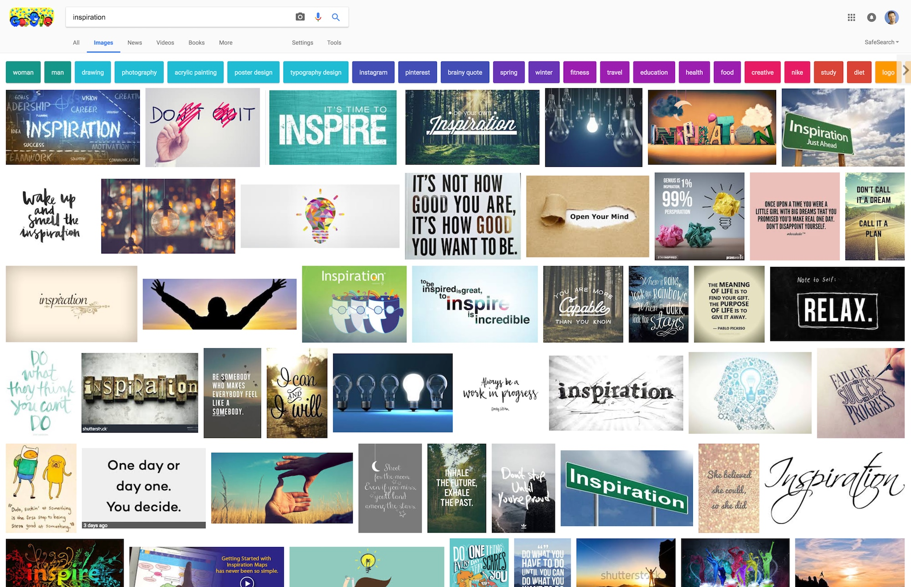

layout: true
class: center, middle
name: pic
background-size: contain

---

layout: true
class: center, top
name: fragment

.title[{{name}}]

---
layout: true
class: center, middle
name: base

.title[{{name}}]

---
name: Lab4 Selections

* [one blog to rule them all](http://cs52-benblog.surge.sh/)
* [lab catharsis](http://traumabox.surge.sh/)
* [preview](http://zchr-lab-4.surge.sh/)
* [comments](http://lab4-kevinfarmer.surge.sh/)
* [comments](http://starterpack-heyssshhh.surge.sh/)
* [comments](http://ogrenblogs.surge.sh/)
* [classy times](http://nmoolenijzer-news.surge.sh/)
* [full width](http://squids-den.surge.sh/)
* [filtering](http://rightful-selection.surge.sh/)
* [pokemon](http://byang-lab4.surge.sh/)
* [retro](http://cs52-lab4-tyler-burnam.surge.sh/)
* [material-ui](http://annie.surge.sh/)
* [snoopy](http://starterpack-ruoniwang.surge.sh/)
* [recipes](http://lab4-emilyjlin95.surge.sh/)
* [cover and error handling](http://cs52-blog-nikoru-chen.surge.sh/)

---
name: CS52 Art

???
* but all the packages

---
name: CS52 Art

.medium_small[]

???
* but they are so pretty!

---
name: CS52 Art

.left[
.tiny[]
.tiny[]

]

.right[
.medium_small[]

]

---
name: Current Final Project Milestone

.fancy.medium[]

* Feature Spec:
  * terse walk-though of project from users perspective
  * terse listing of features
* Mockups/Sketches
  * paper first
  * find inspiration
* User Personas:
  * short and sweet

---
name: Inspiration

.fancy[]

???
* find examples of similar products
* take screenshots
* save urls
* copy color schemes

---
name: Feature Spec

* walk-through as a user
* high level - not buttons

---
name: Mockups/Sketches

* [Design Tips/Workshop](../03_design)
* Tools:
  * [Figma](https://www.figma.com/) Collaborative design
  * [Invisionapp](https://www.invisionapp.com/) Workflow prototyping
  * [Pop](https://marvelapp.com/pop/) Prototyping on paper

???
steps:
1. design inspiration
1. paper Sketches - include how things tie together
1. mockups
1. functional flow

---
name: User Personas

<iframe src="//giphy.com/embed/wnSp3l5BtWWNq" width="480" height="342" frameBorder="0" class="giphy-embed" allowFullScreen></iframe>

* short and sweet
* have names
* have personalities
* have needs
* [userforge.com](http://userforge.com)

???
like real humans
