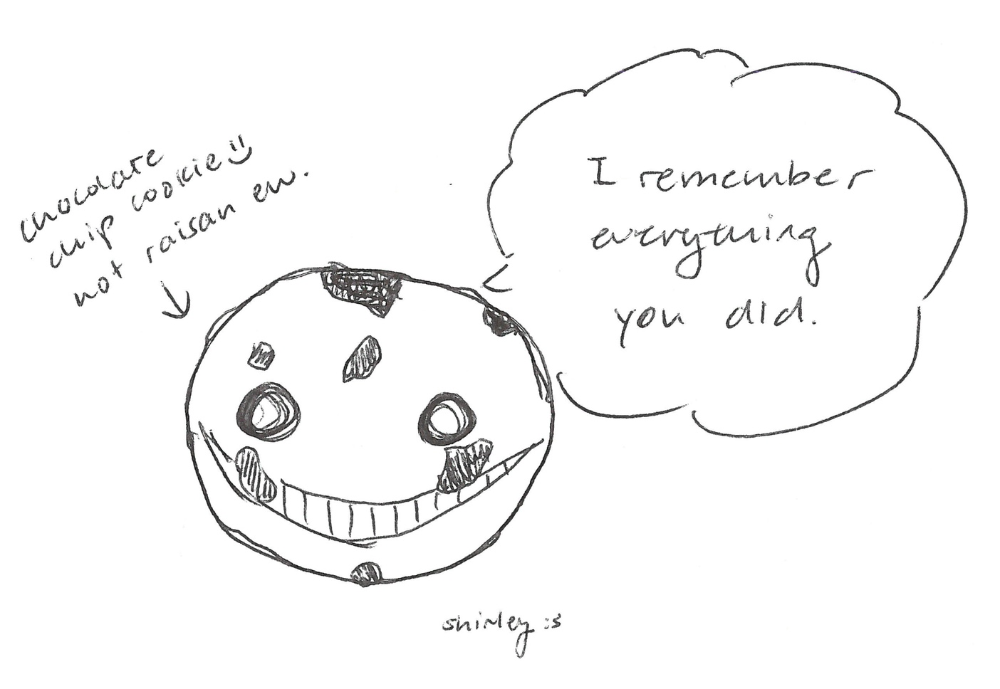
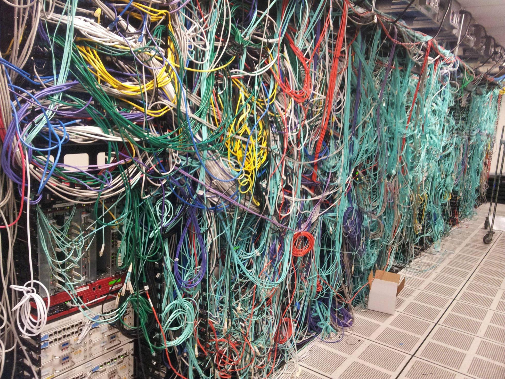
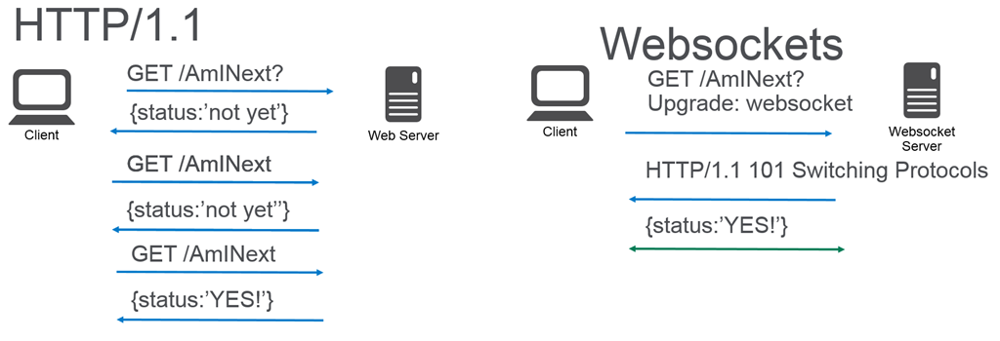

layout: true
class: center, middle
name: pic
background-size: contain

---

layout: true
class: center, top
name: fragment

.title[{{name}}]

---
layout: true
class: center, middle
name: base

.title[{{name}}]

---
name: Websockets


* and stuff


---
name: CS52 Art


.medium_small[]
.medium_small[]


???
* any questions about anything?


---
name: no more labs!


.medium[]


???
* we're done with labs!!!
* only 5 more short assignments to go!
* kidding
* extra credit optional shorts that help with final project
  * websockets - Today
  * s3 uploading thursday
  * testing frameworks next week


---
name: but we do has quiz


.medium[]


---
name: but we do has quiz


<iframe src="https://giphy.com/embed/f4SoNPj4otohG" width="580" height="376" frameBorder="0" class="giphy-embed" allowFullScreen></iframe>


---
name: Dev Site Project Milestone

.medium_small.fancy[]


* GitHub issues
* Continuous Integration (Travis)
* Wiring

???
* Create some github issues
  * goal is to break up tasks into small units 1-2 hours
  * assign each other / yourselves  (aggresiveness)
  * large tasks such as 'login fctionality' are overwhelming
  * break them up into 'create button', 'add signup route', etc
  * keep up with issues, don't just let them stagnate
  * github intengration into your slack channel
* continuous integration
  * PR merge to master automatically deploys
  * idea is to keep a deployed dev site running for testing
  * small feature branches
  * do frequent PR's so you don't fall behind - at least daily
* wiring
  * get frontend talking to backend
  * meaningful data - models etc.


---
name: HTML5 WebSockets

.medium_small[]


???
* in http


---
name: HTTP REST

.medium[]

* request / response
* stateless
* auth tokens
* http verbs

???
* realtime is tricky


---
name: But REALTIME

<iframe src="https://giphy.com/embed/xT5LMFizV0j6HN97iw" width="480" height="274" frameBorder="0" class="giphy-embed" allowFullScreen></iframe>

* ajax polling
* long polling
* streaming


???
* ajax polling:
  * every couple of seconds setInteval
* long polling:
  * poll an endpoint that then keeps connection open and only responds when it has something
* streaming:
  * keep sending incremental data


---
name: HTML5 WebSockets




???
* one persistent connection


---
name: HTML5 WebSockets

* Bi-directional
* Event-based interface -- pub/sub
* Low level socket interface (remember tcp)


.small[]


???


---
name: Pros

* Realtime Events
* pub/sub simplicity
* efficient (no polling)
* stateful connections

???
*


---
name: Why Not Sockets for EVERYTHING?

* low level protocol means more things to implement
  * how to create/update/delete resources
  * no status codes
* stateful protocol
  * need sticky connections
  * more resources to support connections
* no caching, routing, multiplexing, compression

???
* unlike http,  websockets are stateful
* how do you scale many persistent connections
* have to code more from scratch


---
name:


.medium[]

???
* library for working with websockets
* automatic reconnections
* fallbacks in case browser doesn't support


---
name: Outgoing

```javascript
socket.emit('news', { hello: 'world' });
```

???
* send an event with data server or client


---
name: Incoming

```javascript
socket.on('eventname', data => {
  console.log(data);
});
```

???
* subscribe to a triggered event server or client


---
name: Server Connection

```javascript
io.on('connection', socket => {

  //outgoing
  socket.emit('news', { hello: 'world' });

  //incoming
  socket.on('submit', data => {
    console.log(data);
  });
});
```

???
* on establishing a connection


---
name: Client Connection

```javascript
const socket = io.connect('http://localhost');

//incoming
socket.on('news', data => {
  console.log(data);
  //outgoing
  socket.emit('submit', { my: 'data' });
});

```

???
*


---
name: Namespaces Server

```javascript
const chat = io
  .of('/chat')
  .on('connection', socket => {
    chat.emit('a message', {
        everyone: 'in'
      , '/chat': 'will get'
    });
  });

const news = io
  .of('/news')
  .on('connection', socket => {
    socket.emit('item', { news: 'item' });
  });

```

???
* runs these over one connection if connected to more than one namespace (multiplexing)


---
name: Namespaces Client

```javascript
const chat = io.connect('http://localhost/chat')
const news = io.connect('http://localhost/news');

chat.on('connect', () => {
  chat.emit('hi!');
});

news.on('news', (data) => {
  news.emit('thanks Obama');
});
```

???
*


---
name: Callbacks Client

```javascript
socket.emit('fetchPost', id, (post) => {
  console.log(post);
});
```

???
* you can use callbacks with events!!
* emitting an event that also has an associated callback that gets returned


---
name: Callbacks Server

```javascript
socket.on('fetchPost',  (id, done) {
  Post.findById(id).then(post=> done(post);)
});
```

???
* server side
* soo cool


---
name: broadcast

```javascript
socket.broadcast.emit('user connected', username);
```

???
* can broadcast to all connected users


---
name: Workshop!

[cs52.me/assignments/sa/websockets](/assignments/sa/websockets)


???
