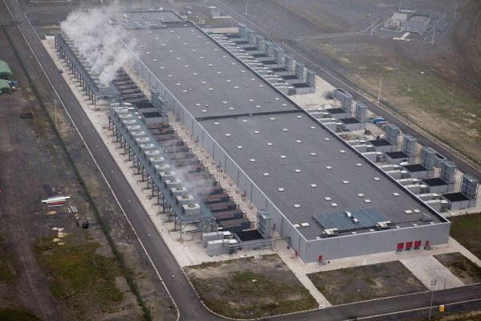

layout: true
class: center, middle
name: pic
background-size: contain

---

layout: true
class: center, top
name: fragment

.title[{{name}}]

---
layout: true
class: center, middle
name: base

.title[{{name}}]

---
name: Scaling

CURRENTLY UNUSED _ EXPAND THIS TO TALKA BOUT SCALING MORE!

.fancy[]

 

???
* scaling technically and also in users
* where are these servers?
* also here's some of the crazy infrastructure
* that is running all your labs and projects
* when you do a git push
* travis, heroku, aws,etc
* all these tools make it so much easier to do this Stuff
* used to be you need to get a high speed connection to your house to run a website

---
name: Datacenter Infrastructure

* 1 datacenter:
  * 15-40 megawatts power
  * 50,000-200,000 servers
  * 24/7 staff: 15
  * $1B construction
* in world:
  * 7.2mil

???
* hardware failures alone...
* power
* backup
* network
* cooling
* failures
* some numbers thrown around for cost per search in terms of electricity ends up being between 1cent to 1$ depending on how much of the infrastructure you include. if only google then 1c if you include your computer, all the internet from your computer to google, all the routers used while google crawls pages and then the number goes up.s

---
name:

.medium.fancy[]

* 2016, global IP traffic was 1.2 ZB per year or 96 exabytes (one billion gigabytes) per month

???

---
name:

.medium.fancy[]

* mining bitcoin between 2.55-7.7 gigawatts (0.5 of total energy market)

???
* between ireland and austria
* but becoming more efficient 
* regardless, is it ethical to convert energy directly into wealth?
* and it just became harder with the recent bitcoin halving

---
name:

.fancy[]

???
* at google
* need ear protection

---
name:

.fancy[]

???
* power and cooling at google

---
name:

.medium_small.fancy[]

.medium.fancy[]

???
* heroku datacenters

---
name:

.fancy[]

???
* liquid dipped

---
name: Problems Of Webdev

.small.fancy[]

* Software engineering problems programming *at scale*
  * javascript lack of strong type system
  * browser support
  * interpreted performance
  * too much tooling

???
* What are some complaints about webdev?
* you all? 

