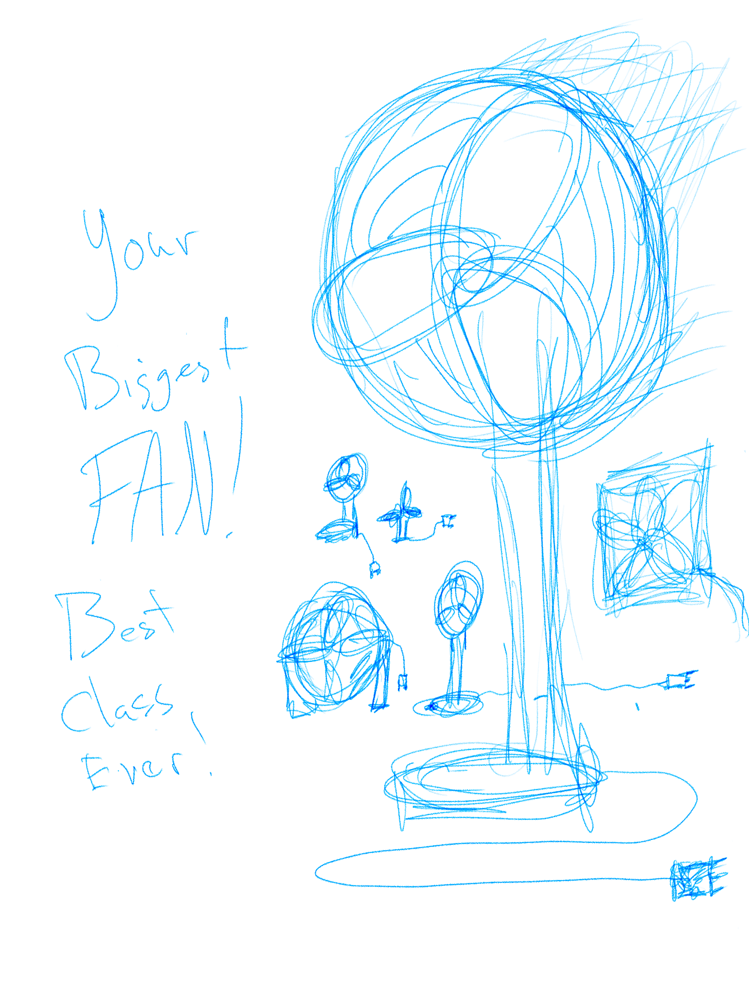
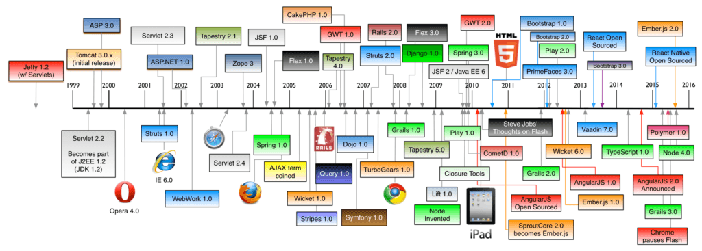

layout: true
class: center, middle
name: pic
background-size: contain

---

layout: true
class: center, top
name: fragment

.title[{{name}}]

---
layout: true
class: center, middle
name: base

.title[{{name}}]

---
name: My Turn to DRAW

.medium_small[]


---
name: Datacenters


<iframe src="//giphy.com/embed/l39727g11ikHsDzKE" width="780" height="568" frameBorder="0" class="giphy-embed" allowFullScreen></iframe>
<br>


???
* where are these servers?


---
name: Datacenters

* 15-40 megawatts power
* 50,000-200,000 servers
* 24/7 staff: 15
* $1B construction

???
* hardware failures alone...


---
name: Considerations

* power
* backup
* network
* cooling
* failures

???


---
name:


???


---
name:


???


---
name:


???


---
name:


???


---
name:


???


---
name:


???


---
name: Problems Of Webdev

* Software engineering problems programming *at scale*
  * javascript lack of strong type system
  * browsers
  * interpreted performance

???
* What are some complaints about webdev?


---
name:  The future!

* language and framework improvements
* es7 (not much there)
* es8?!
* taking over the world (desktop and mobile)

???
* in the stanford webdev class currently being taught react is "the future"
* you guys learned the latest and greatest.  fun right?


---
name: async and await

```javascript
export default async function getLikes () {
  const users = await getUsers();
  const filtered = await filterUsersWithFriends(users);
  return getUsersLikes(filtered);
}
```

* syntax on top of promises
* await casts to promise
* returns promises
* errors -> reject
* return -> resolve
* available now in babel `stage-3`

???
* is like wrapping a promise in a generator
* returning intermediate values
* https://zeit.co/blog/async-and-await#the-future:-async-and-await
* http://bevacqua.github.io/promisees/


---
name:  The future: Observables


<iframe width="560" height="315" src="https://www.youtube.com/embed/lil4YCCXRYc?rel=0&amp;showinfo=0" frameborder="0" allowfullscreen></iframe>

* asynch methods that can be subscribed to
  * function which returns an observable stream of events
  * can map / filter over streams of events
  * producer -> consumer
  * es8?

???


---
name: More FP Please!

* functional programming paradigms
* scalability and parallelism
* testability

???
* immutability
* vector programming
* mocha with chai for testing


---
name: Big Data Cloud

* more scalable architectures in the "clooouudd"
* cloud functions:
  * Azure Functions
  * AWS Lambda
  * Google Cloud Functions

???
*  functions in the cloud


---
name: Instant Apps

* Android Instant Apps
* iOS App Thinning
* apps that stream native to mobile
* react-native though...


???


---
name: ?


???
* you invent the future!


---
name: Full Stack


<iframe src="https://giphy.com/embed/3js0YStjZMYZq" width="271" height="380" frameBorder="0" class="giphy-embed" allowFullScreen></iframe>

* lots to it
  * make pretty things
  * architect web services
  * storage

???
* in practice devs focus on particular parts of the stack
* we covered a lot and you all rock


---
name: Moving Fast

* new developments all the time
* stacks and tools evolving

.medium[]


???
* hopefully this class has given you navigation abilities in the confusing world of webdev


---
name: Last Words

<iframe src="https://giphy.com/embed/IcGkqdUmYLFGE" width="480" height="270" frameBorder="0" class="giphy-embed" allowFullScreen></iframe>


???
* thank you
* learned from you
* hope you will keep making stuff
* pass on your knowledge


---
name: Last Words

* Related Courses:
  * cs65: Mobile
  * cs74: ML
  * cs60: Networks
* Cool Courses:
  * cs89: Computational Fabrication
  * cs76: AI

???


---
name: Last Words

.medium.fancy[]


* DALI!
* Potential Future Courses:
  * Cloud Computing Course (big data/scalability)
  * Game Dev (game from ground up)
* Keep building!

???
* future courses pending
* course assesments and carson 61 survey


---
name: Project Demos!

* SUCH EXCITE!

???
