layout: true
class: center, middle
name: pic
background-size: contain

---

layout: true
class: center, top
name: fragment

.title[{{name}}]

---
layout: true
class: center, middle
name: base

.title[{{name}}]

---
name: CS52 It's Been Real

<!-- .large.fancy[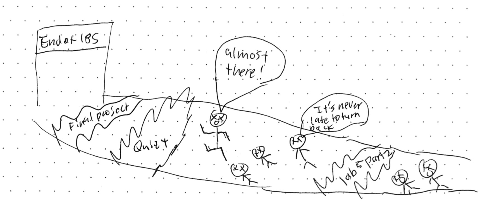] -->

.large.fancy[]

<!-- * [final drawings pdf](img/cs52-final-drawings-18s.pdf) -->

???
* last class - XHOUR tomorrow for bughunt though!
* been and honor and a pleasure to work with you all, i’m excited for demos to see it all come together
* hopefully it has been a rewarding experience so far (and if not you have a week left to fix that)!  

---
name: At times

.medium.fancy[]

???
* probably felt like the barrage would never end
* but here we are

---
name: Maybe Even a Little

.large.fancy[]

???
* don't worry i had a few moments like this too

---
name: What you've accomplished

.medium.fancy[]

???
* in 9 short weeks
* you've learned so much
* some code patterns
* some tools
* some languages
* final projects tie it all together

---
name: Faced Monsters

.medium_small.fancy[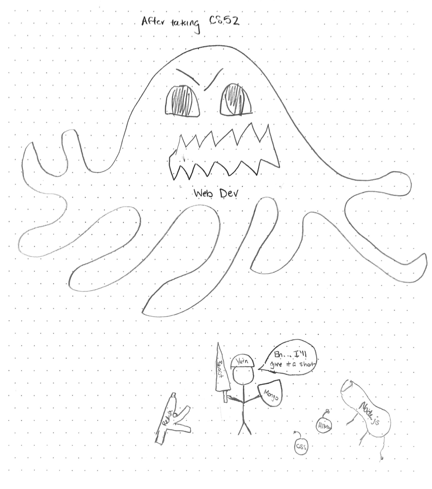]

???
* maybe some of the labs, certainly some bugs

---
name: Conquered Dragons

.medium_small.fancy[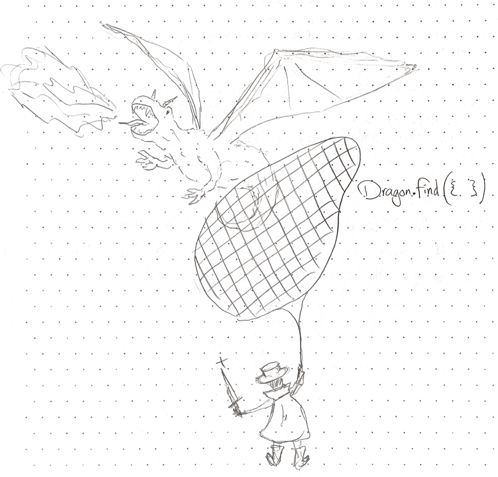]

???
* faced off with dragons

---
name: Client and Server

.medium_small.fancy[]

???
* seen things you can't unsee
* even survived my gifgame

---
name: Done all the EC? 

.medium_small.fancy[]

???
* and thankfully no quizzes!
* but hopefully memorized the redux data flow anyway

---
name: Lots of Workshops

.medium_small.fancy[]

???
* you know all the webdev lingo now
* someone says, jekyll you say? 
* mocha? 
* chai?
* material-ui?
* flask? 
* someone says rm -rf /, you say?

---
name: Applied Your Knowledge

.medium_small.fancy[]

???
* hopefully had the chance to apply your knowledge 
* to building cool products that you enjoyed 
* and had a chance to show off as well

---
name: Rebase Squash Commit That Internship

.medium.fancy[]

???
* know enough git to school others at your current/future jobs

---
name: Copy/Pasted a bunch

.medium.fancy[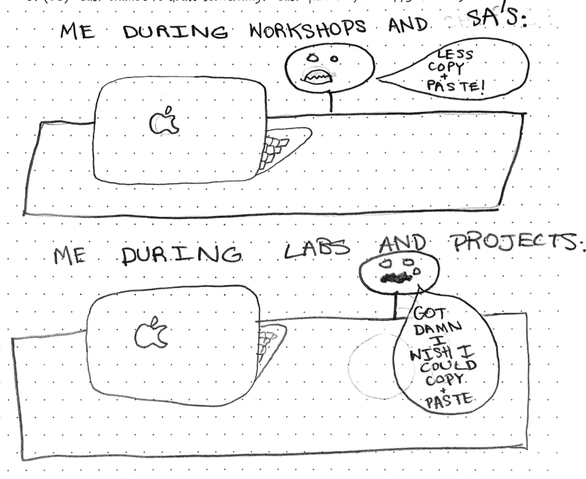]

???
* but built lots of cool projects
* and given feedback and improved the class for future generations

---
name: And Waxed Poetic

.medium_small.fancy[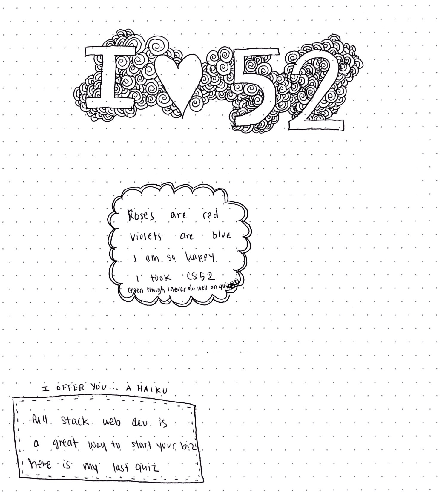]

---
name: You've Earned It

.medium_small.fancy[]

???
* you are all rockstarssss

---
name: Scaling

.medium_small[]

 
* have the tools to scale
  * heroku, atlas cloud, etc
* web architecture (client + api server)
* state and data management (redux, mongo)

???
* scaling technically and also in users
* where are these servers?
* also here's some of the crazy infrastructure
* that is running all your labs and projects
* when you do a git push
* travis, heroku, aws,etc
* all these tools make it so much easier to do this Stuff
* used to be you need to get a high speed connection to your house to run a website
* 

---
name: Problems Of Webdev

.small.fancy[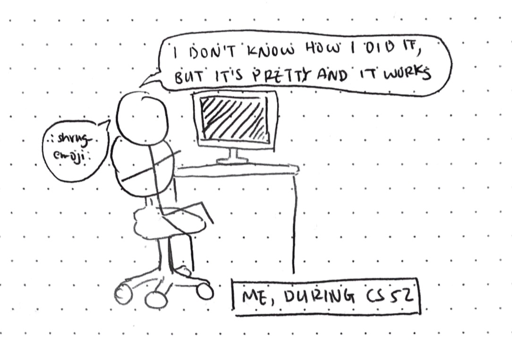]

* Software engineering problems programming *at scale*
  * javascript lack of strong type system
  * browser support
  * interpreted performance
  * too much tooling

???
* What are some complaints about webdev?
* you all? 

---
name:  The future!

* language and framework improvements
* javascript constantly evolving
* taking over the world (desktop and mobile)
* progressive web apps
  * offline
  * web push notifications
  * add to home screen
* instant apps (streaming mobile apps)
* tooling improvements
* react-native for web/desktop!
* react for VR!

???
* you guys learned the latest and greatest - but
* constantly evolving tools - getting easier every day :)

---
name: You Invent The Future

.medium_small.fancy[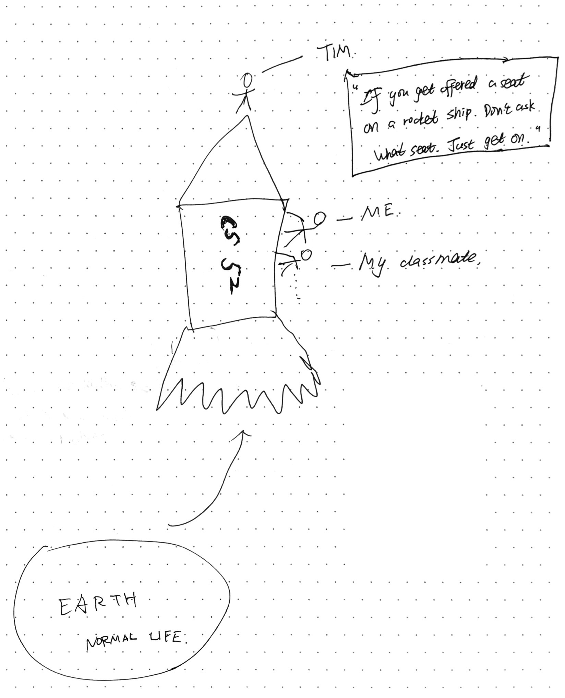]

???
* i didn't draw this
* you invent the future!
* but ask questions - be engaged in your craft
* be curious about the whys not just copy/paste from stackoverflow
* contribute to software development  - build libraries, open source
* 

---
name: Full Stack

.tiny[]

* lots to it
  * make pretty things
  * architect web services
  * storage
  * you now have all the tools

???

---
name:

.medium[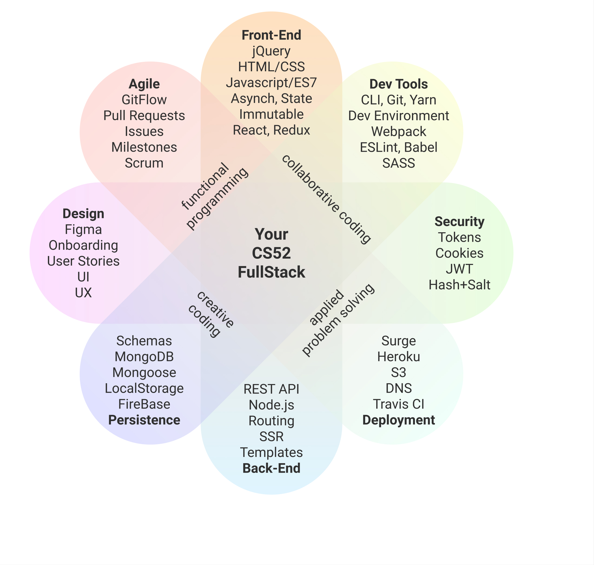]

???
* in practice devs focus on particular parts of the stack
* we covered a lot and you all rock
* is there more we could have covered, always!

---
name: Moving Fast

* new developments all the time
* stacks and tools evolving

.medium[]

???
* hopefully this class has given you navigation abilities in the confusing world of webdev

---
name: Last Words

<iframe src="https://giphy.com/embed/IcGkqdUmYLFGE" width="480" height="270" frameBorder="0" class="giphy-embed" allowFullScreen></iframe>

???
* thank you
* learned from you
* hope you will keep making stuff
* just some pre-parting words

---
name: Pass On What You have Learned

.medium_small.fancy[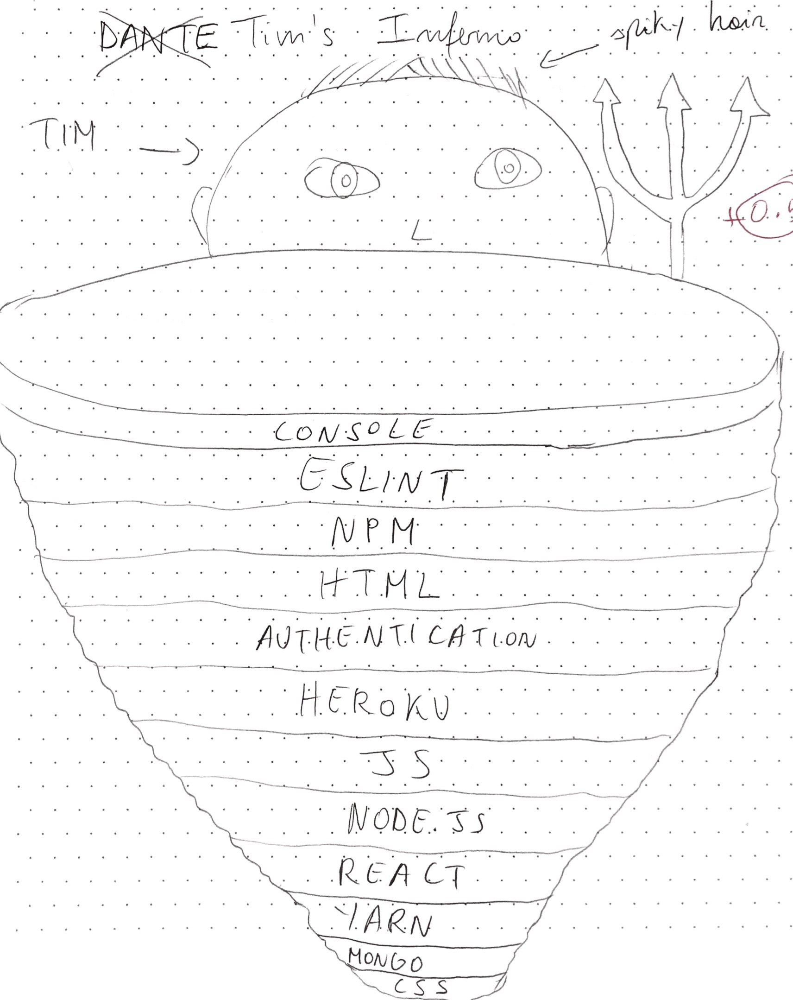]

???
* you've learned so much
* don't worry if you keep building more and more of it will make sense
* you have the foundation to do great things

---
name: Interact With The Community

.left.fancy[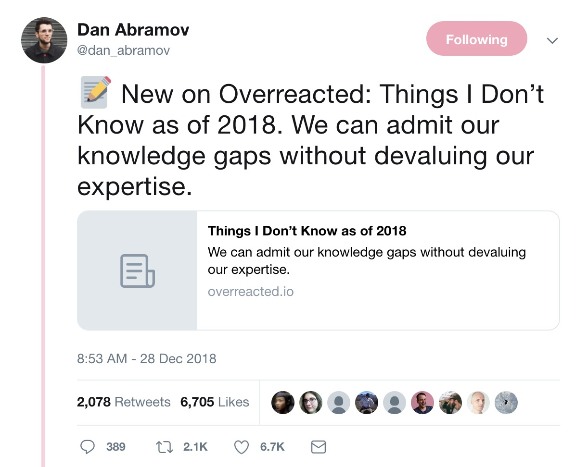]
.right.fancy[]

* https://overreacted.io/things-i-dont-know-as-of-2018/

???
* dan abramov 
* the guy behind redux and now lots of react improvements
* admits to not knowing python, flexbox, algorithms, node, bash
* honestly inspiring to read - you don't need to know everything to be a contributor

---
name: Love the Craft

# Set up your editor the way you like it
# Geek out about the tools of the trade
# Enjoy the process
# Get in the zone

---
name: Keep Building Stuff

.medium.fancy[]

???

---
name: Invest In Your Life

.small.fancy[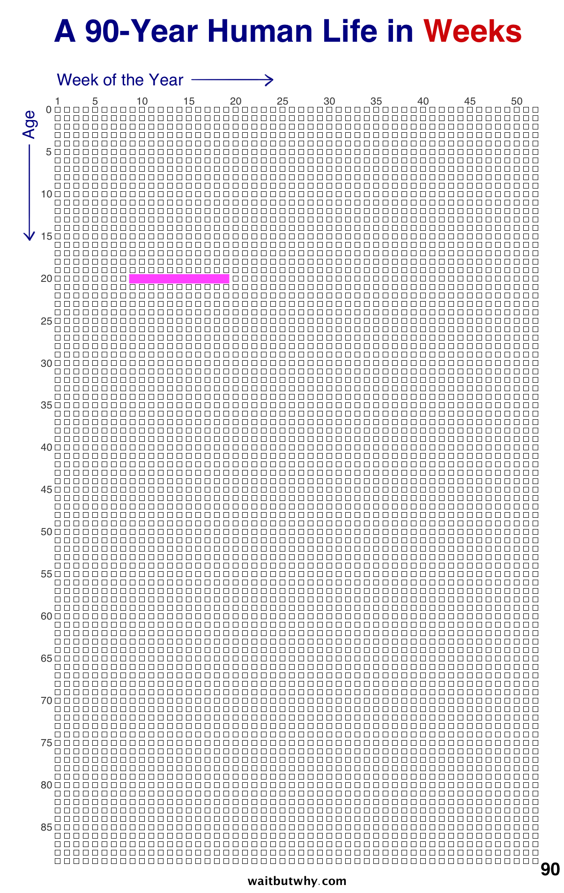]

* https://waitbutwhy.com/2014/05/life-weeks.html

???
* this is your life in weeks
* and how much of your life was CS52, worth every second!

---
name: Build Things That Matter

.medium_small.fancy[]

???
* You have time, use it to make a better world

---
name: Build Things That Matter

.medium[]

???
* another image from the same waitbywhy blog - a lot has been written about what makes a good life
* this guy summarizes it:  working to improve the future or the lives of others is what makes for a good week. 
*  with or without this class - you have the tools to make an impact

---
name: Web Dev Solutions @scale

* Challenges:
  * WhatsApp: "irresponsible and explosive messages"
  * Facebook: please regulate us before we hurt someone
  * Slack: noise over knowledge
  * Attention Economy: competing for your attention with garbage, selling your time and data for what?
* Many Opportunities:
  * resource sharing
  * health
  * education
  * society

???
* when you set out to build a platform that lets you rate your friends (fb) or send messages to groups (whatsapp)- you think you're doing a good thing, but at scale lots more issues to consider.
* whatsapp - theoretically brings people together - but also promotes mob killings.
* facebook - zuckerberg in the congressional hearings last year asked for new laws, but has since dug in on freedom of expression and allowing political advertising on the platform
* slack: productivity tool but also makes people feel productive when they are asking and answering questions that should have been documented better - millions of hours of productivity lost - people spending online instead of with their families
* be mindful 
    * lots of industries where scale will bring change
    * health - small monitoring and motivation improvements can extend lifespans, increase happiness
    * society - bringing people actually closer rather than dividing them - maybe VR
* as soon as you start thinking in terms of scale - everything gets more interesting
* and you've just learned the tools that enable solutions @scale

---
name: Adventure

.super-tiny[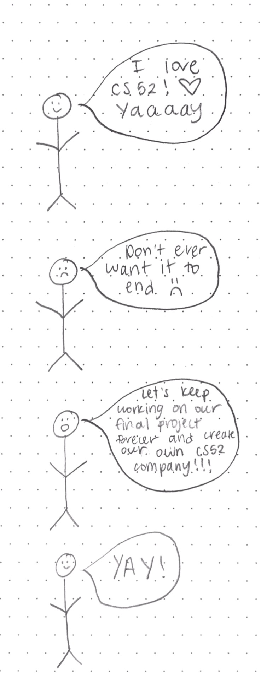]

???
* for me it has been an adventure - miss you all already

---
name: My turn to draw

.medium_small[]

---
name: Almost done!

.medium.fancy[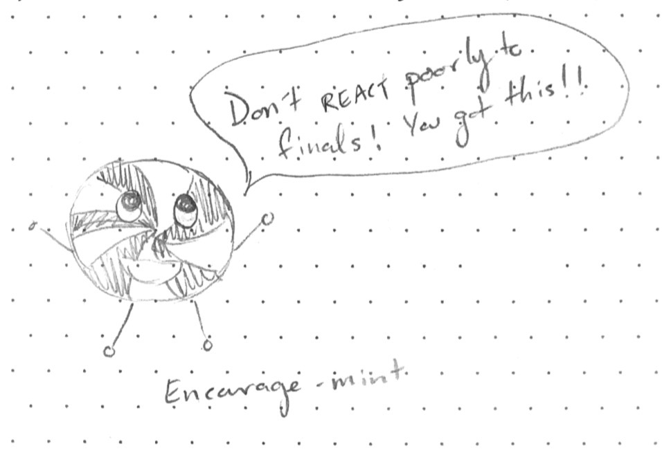]

???
* almost done

---
name:
class: black-background 

<!-- .medium.fancy[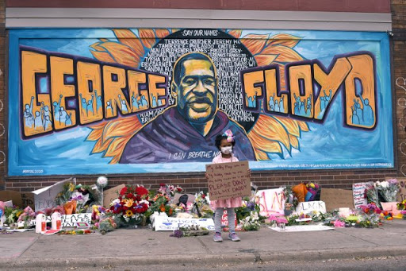] -->

???
I wanted to say a few words about our where we find ourselves. Not sure there are any words to describe or deal with the strange times (regardless of your political affiliation) that we live in: coronavirus, endemic racism and prejudice, economic and social inequality, environmental issues, extremist views, and the absence of rational and fact based discourse, among many other problems facing our generations.

You may think, what is my individual role, what is the meaning of spending time on cs52 when the world is going to shit. as i try to figure these things myself have been having some thoughts.

Everything you do becomes part of you and helps you grow, in this course/during these times maybe you learned some code frameworks, maybe how to work better on a team, or how to get along with family, or hate css, or love react.

However small some of that might feel, it still helps you along your path, and it doesn't matter what that path is - if you learned you hate styling, that helps you along your path to something else. if you learned you love server side coding, may that be something you get to do more of. In my past I wanted to be, an opera singer, a photographer, a graphic designer, a wood carver, a russian teacher, all of that is part of me. and aside from 52, crisis times build us up as well.

The other thing is that everything you do, no matter how small it seems has impact. every decision you make, creates the world in your image and likeness. it isn't often apparent that we are all part of an interconnected system, not just of human society but of the natural world as well. what you eat, when you wake up, how you treat your friends and enemies, is all part of the big data that forms existence as we know it. thus what you choose to work on, the people you keep company with, are all important. you are inventing the future with every action you take. and they don't all have to feel dramatic at all to still be meaningful.

this is turning into some sappy graduation speech. mostly I just want to say that as we stumble through history, from the individual breaths we take, to our achievements in affordable space flight, to battling for justice and a better world, your actions matter and you matter.  i haven't gotten to know you as well as would like to - so stay in touch - you'll always be in the slack team.

one last thought, last term i had an argument with a couple of friends about politics. not specific politics but basically of letting ones politics be known as a teacher. one side of the argument, from theater prof at middlebury was saying that politics is a huge part of theater and that he feels comfortable talking about his politics with his students. the other, his brother, was disagreeing saying that all politics should stay out of academia, to let students come up with their own beliefs.

there's a lot to unpack there. my thought is that we are all people, and that it is ok for students to get to know you as a person, complete with whatever beliefs you might have. regardless, i'm not about to start talking politics now

however i think there is a deeper issue here, politics in general is often dismissed as something like a bad word. but all it should mean is how our society is organized, and we shouldn't be afraid to talk about issues of how we want our cities and countries to be organized. just like everything you do has meaning, everything is also a political act. from buying groceries and going to work, to paying taxes and registering your car. 
and back to class context: the tech world is now the forefront of politics, so you can't get away from it. see dorseys fight with zuckerberg, or the tiktok ban- it isn't really about trump at all, it is those tech companies taking different ethical stances. defining what freedom of speech means, what facts mean, and what civil society means. fascinating, and worth thinking about and engaging with. so as a political actor regardless of whether you want to or not, you choose the world when you peruse a social media platform just as much as when you engage in local politics to elect a sheriff. both are things to think about.

anyway, thats that. mostly just wanted to say, we have challenges, and we may feel powerless, but have courage, ask questions, be engaged, and create the world you want to live in with every action and with your cs52 skills.

---
name:

.small.fancy[]

???

