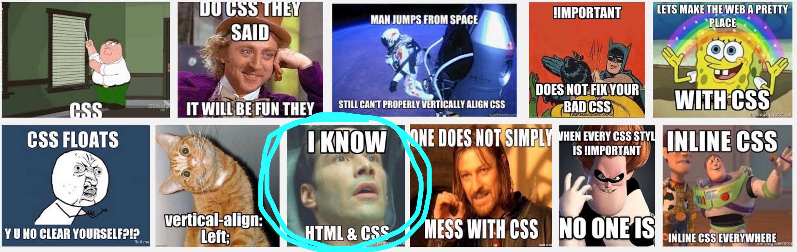

# CSS — Cascading Style Sheets

## Semantics vs. Style

So far we have been defining structure but have not done anything with how they are displayed.  We have mostly relied on the default display styles provided by the browser.  When you set the `h1` tag the font size increased, but we didn't control it directly.  What we were defining was a section of content that was intended to be a header of level 1.

In Microsoft Word,  the default way to format the document is by setting typesetting directly.  You select something and change the font size, or make it bold.  The problem with this is that it unmaintainable in the long term.  Want to change all your headings?  Good luck — should have set up some styles.

The idea behind markup is to help separate the meaning (or semantics) from the style. You specify the intended use of the content,  whether it is a header or a paragraph etc,  and then you define the look and feel of these blocks separately.

The next step is to explore how to do style!

## Enter CSS

{: .fancy .small }

CSS will be friend and foe this term.  Certain things will be easy, certain things will feel impossible.  Try to vertically align something. We will conquer this though.

{: .fancy }

Ok, enough fun.


## Selectors!


CSS is a list of rules specifying how elements should be displayed. Each rule starts with a selector: a bit of text that selects some elements of the HTML.  When you gave your page structure you defined the elements that could be selected with CSS!


A selector can target elements in different ways:

a tag name:

```
p {
  color: blue;
}
```

a class:

```
.classname {
  color: pink;
}
```

an id:

```
#elementid {
  color: black;
}
```

and any of the above plus special keywords such as `hover` which refers to the state something is when your mouse hovers over it:

```
p:hover {
  color: orange;
}
```


### Classes and Ids?

What happens if you have multiple elements that you want styled differently!

You can use the `class` and `id` attributes.

```
<p class="fancy">Some fancy paragraph formatting</p>

<p id="username">A unique username paragraph</p>
```

By adding an `id` to an element you give it what should be a unique identifier on your page.  This is useful for elements that have a special role where there is really only just 1 of them on the page — *primary_navbar* or *username_field*, etc. The `id` is assigned a string identifier.

By adding a `class` to an element you are saying it belongs to set of elements that should be styled a particular way. Where styled really means selected. The `class` property is assigned a space separated quoted string with potentially multiple classes. `class="aclass"` but also `class="aclass anotherclass"` this is convenient as you can have one element belong to multiple style classes, inheriting styles from each!  

The result of all of this.  Define your style information once and use it in many places.

### DIV and SPAN

You can use the `<div></div>` and `<span></span>` elements in your HTML as elements that come with no default meaning in HTML. What is the difference?

[`div` elements (divisions)](http://www.w3schools.com/tags/tag_div.asp) take up space by default because browsers give them the following CSS: `display: block;`

[`span` elements](http://www.w3schools.com/tags/tag_span.asp) have no default style and can be used inline with other tags.  For instance to separate a word from a sentence.

<!-- TODO: move to HTML? -->

### Simple Example With Selectors and Colors

<p data-height="400" data-theme-id="24117" data-slug-hash="a54aae158ba02e5e4cfe33c089277603" data-default-tab="css,result" data-user="timofei" data-embed-version="2" data-editable="true" class="codepen">See the Pen <a href="http://codepen.io/timofei/pen/a54aae158ba02e5e4cfe33c089277603/">a54aae158ba02e5e4cfe33c089277603</a> by Tim Tregubov (<a href="http://codepen.io/timofei">@timofei</a>) on <a href="http://codepen.io">CodePen</a>.</p>

Actually if you want a real CSS Selector Game play:  [CSS Diner](http://flukeout.github.io/)

Note: I cheated in the above example and included some magic for that font.

## Fonts

The [default fonts](http://www.w3schools.com/css/css_font.asp) that browsers support are a bajillion years old.  Please don't design your pages with Times New Roman.

Best way to get prettier fonts is to use [Google Fonts](https://www.google.com/fonts). Simply choose a font you want and Google gives you a stylesheet to include in the head of your HTML.

Here's Open Sans (a lovely simple font):

`<link href='https://fonts.googleapis.com/css?family=Open+Sans' rel='stylesheet' type='text/css'>`

and use:
```
body {
  font-family: 'Open Sans', sans-serif;
}
```
To make it the default! 💗


## CSS Inside

There are 3 ways to include CSS styles in your page.

* Inline style: `<p style="color: orange;">` BAD
* Internal style sheet: is a block of CSS inside of your html. Better.
* External style sheet: separate file included in head section. BEST.
* CSS Preprocessor Magics:  is actually best, we'll look into this more later. See: [SASS](http://sass-lang.com/)


```
<!DOCTYPE html>
<html>
  <head>
    <title>CSS Loaded 3 Ways</title>

    <!-- Internal Style Sheet: MEDIOCRE -->
    <style type="text/css">
      h1 {
        color: purple;
      }
      body {
        background-color: orange;
      }
    </style>

    <!-- External Style Sheet: BEST -->
    <link rel="stylesheet" type="text/css" href="mystyle.css">

  </head>
  <body>

    <h1>Title</h1>

    <!-- Inline Style:  WORST -->
    <p style="color: white">Paragraph Stuff</p>

  </body>
</html>
```


## Position, the old way

<p data-height="400" data-theme-id="24117" data-slug-hash="cc696879a64585dc629b27fba80c183d" data-default-tab="css,result" data-user="timofei" data-embed-version="2" data-editable="true" class="codepen">See the Pen <a href="https://codepen.io/timofei/pen/cc696879a64585dc629b27fba80c183d/">floats</a> by Tim Tregubov (<a href="http://codepen.io/timofei">@timofei</a>) on <a href="http://codepen.io">CodePen</a>.</p>

The [`float` CSS property](http://www.w3schools.com/css/css_float.asp) specifies that an element should be taken from the normal flow and placed along the left or right side of its container. Text or other inline elements will wrap around it.

Floating can get tricky.  There is also a [`clear` CSS property](http://www.w3schools.com/css/css_float.asp) to control which elements should *not* float.

## Flexbox!

Positioning used to be miserable. With CSS3 [Flexbox](https://css-tricks.com/snippets/css/a-guide-to-flexbox/) make things much better.

Flexboxes are worth learning. Here's a simple playable example.

<p data-height="505" data-theme-id="24117" data-slug-hash="03b6b8b6dace6d8f7c666514ac66bead" data-default-tab="css,result" data-user="timofei" data-embed-version="2" data-editable="true" class="codepen">See the Pen <a href="https://codepen.io/timofei/pen/03b6b8b6dace6d8f7c666514ac66bead/">simple flexbox</a> by Tim Tregubov (<a href="http://codepen.io/timofei">@timofei</a>) on <a href="http://codepen.io">CodePen</a>.</p>

Want to learn more?
**go play this now** [FLEXBOX TOWER DEFENCE GAME](http://www.flexboxdefense.com/)

[This](https://css-tricks.com/snippets/css/a-guide-to-flexbox/) has good examples also.


## Precedence and Cascading

CSS is named the way it is because is each style sheet applies in a cascading manner.


Imagine the situation where there's a nice set of CSS styles that you'd like to use in your site. For instance [Bootstrap](http://getbootstrap.com) is a well know CSS framework but you need to customize and override some things.  You'd add in your own stylesheet to load later and the styles would apply on top of the previous ones. The precendence order is a bit more complicated:

* The more specific our selector is the higher its weight (e.g. a selector having three classes will win a selector with two classes)
* A more specific selector takes over a less specific one, regardless of the order in which they appear
* When two selectors have the same specificity, the one that comes second (in order of loading) wins
* !important always gets the highest precedence (use sparingly — prefer to just be more specific)
* Inline styles have second highest precedence (hence bad because hard to override)
* The universal selector (\*) has zero weight

(from: [Zacky Pickholz](https://www.linkedin.com/pulse/most-important-css-rule-you-might-have-missed-zacky-pickholz))


## Further Learning: Use the Source, Luke ([UTSL](https://en.wikipedia.org/wiki/UTSL))

One way to both see how things are done and also to test out changes is to the use the Inspector!

TODO:  add inspector tutorial here


[Stanford:CS142]: http://web.stanford.edu/class/cs142/  "Stanford CS142 Class"
