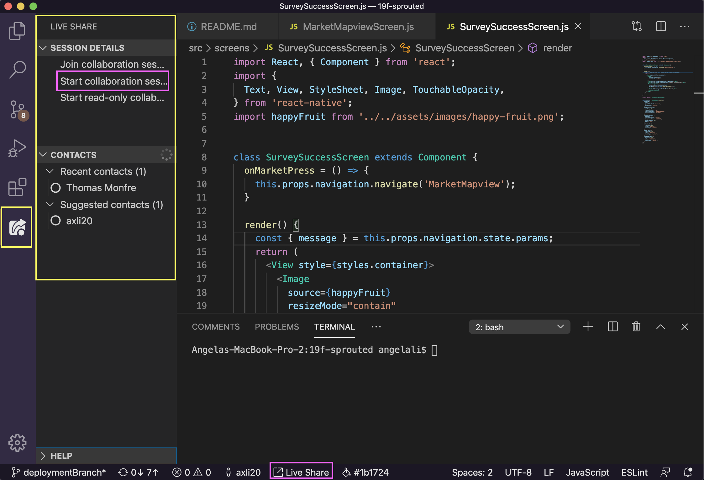
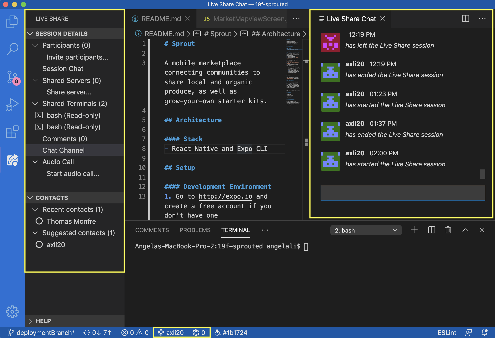
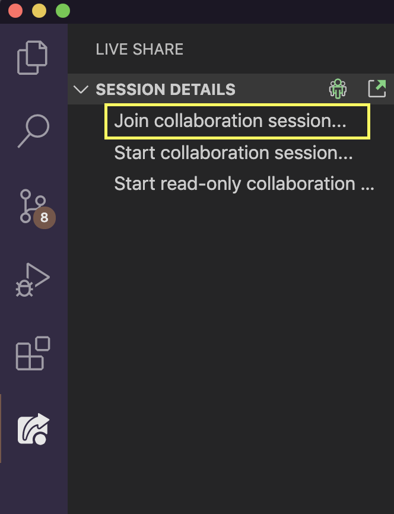
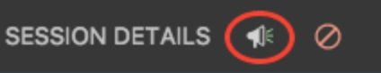
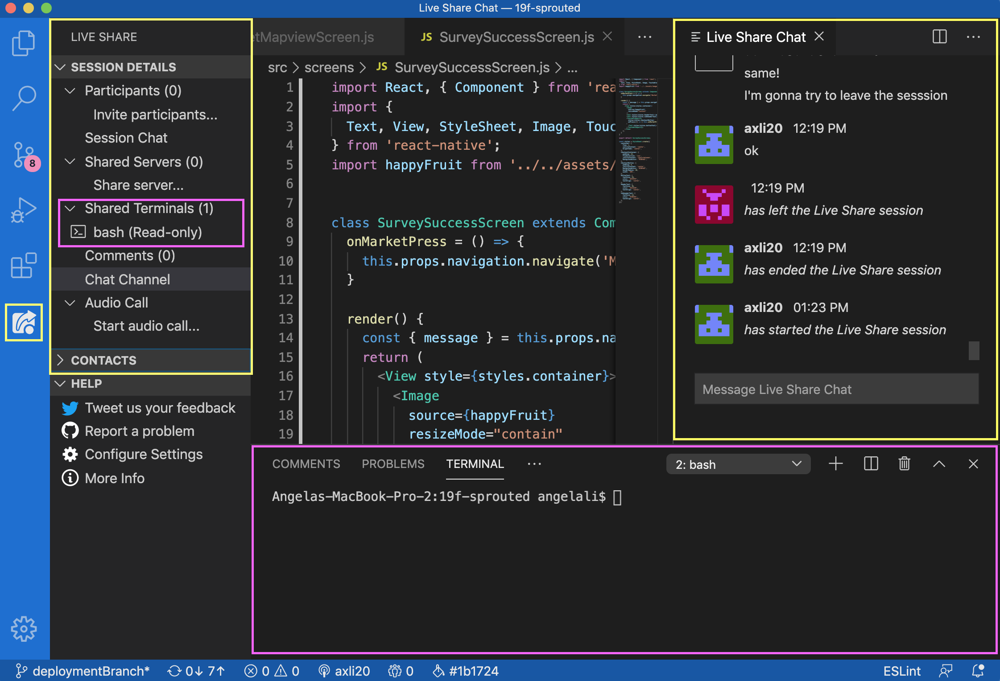

## Guide to Installing and Using VS Code Live Share

Now that 20S has gone remote, us developers are going to need new tools to help us code collaboratively! Lucky for us, Visual Studio Code has a super useful and easy-to-use extension pack called **Live Share Extension Pack**. 

This guide will walk you through:

- [**What it is**](#what-is-the-live-share-extension-pack?)
- [**How to install**](#how-do-i-install-it?)
- [**Useful features**](#useful-features)

We highly recommend that you use VS Code as your code editor this term so that everyone can have a consistent way of collaborating! The TAs will all be using Live Share as well.

## What is the Live Share Extension Pack?

The Live Share Extension Pack gives VS Code users the ability to remotely code collaboratively, with features like editing the other user's code directly, navigating through all of their files, shared terminals, and integrated audio* & text chat.

Why can't I just use Zoom and the screen share/control feature?

You can, but having everything in one place in VS Code makes it so much simpler to focus on the task at hand, rather than having to manage multiple apps. It also takes up a lot less RAM, so your computer won't sound like a plane engine.

*The audio component is still in beta, so it might or might not work for some of you. If the audio doesn't work, feel free to use Zoom for audio.

## How do I Install it?

1. First, make sure you have [Visual Studio Code](https://code.visualstudio.com/download) installed. 
2. Next, follow the steps in the guide here: [Install Live Share Extension Pack](https://marketplace.visualstudio.com/items?itemName=MS-vsliveshare.vsliveshare-pack)

## Useful Features

### Overview
- [**Starting a Session**](#starting-a-session)
- [**Joining a Session**](#joining-a-session)
- [**Following**](#following)
- [**Shared Terminals**](#shared-terminals)

For more in-depth and detailed documentation visit this [link](https://docs.microsoft.com/en-us/visualstudio/liveshare/use/vscode).

### Starting a Session

Here's what Live Share should look like after you've installed it:

The extension icon and panel are highlighted in yellow.

There are two ways to start a collaborative Live Share session (meaning all participants can edit the code) which are highlighted in the pink boxes above.

What's the difference between read-only and collaboration sessions?

Collaboration sessions allow all participants to edit code and access shared terminals. Read-only sessions allow participants to view the code, but not make edits.

When you start a session, you become the host. **To invite others to the session, send them the session link that's automatically copied to your clipboard**. 

How can I find the session link again?

Simply click "Invite participants..." under the Participants section in the panel, and it will copy the link for you again.

Here's what an active session looks like:

All the details are in the left hand panel, and the chat comes up as it's own window. You can try out the audio calling feature, but it didn't work when we tested it.

### Joining a Session
To join a session, click "Join collaboration session" and enter the session link sent by the host.

### Following
A useful feature in this extension is called "Following", where people in the live share can "follow" the actions of a specific participant. So if the person you're "following" changes files or scrolls down the code, you're screen will automatically follow along! Useful if helping to debug or explain the flow of some code.

To "follow" anyone in the session, just click on their name under "Participants". If you're the host and you want everyone to follow you, click on the "focus" button that comes up when you cover next to "Session Details".

### Shared Terminals

Live Share let's you share terminals, so any participant can access the same terminal being shared. Highlighted in pink below.

