Today we'll learn a few design concepts and build a quick mockup for a future assignment!

## Design Brief

We'll design something akin to a Buzzfeed® quiz.  The specific designs in this tutorial can be improved so you should feel free to be as creative as you want: use your own images, come up with your own layout, the techniques described here are just meant to whet your appetite for design.

## Figma

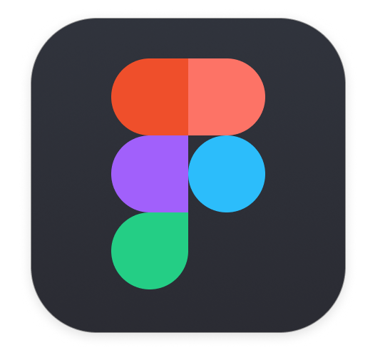{: .tiny}

Figma is a browser-based interface design tool.  We'll use it to layout our webpages and even do more complicated digital design. Figma also allows for live team editing of files. This means that you can access your files from any computer by simply logging in, and anyone on your team can edit files and use shared components.

Figma also has Desktop apps available for download if you prefer that!

If you want to learn more about Figma there many online tutorials including the [Figma YouTube Channel](https://www.youtube.com/channel/UCQsVmhSa4X-G3lHlUtejzLA) that has a lot of short useful videos.

## Getting Set up
Go to [figma.com](https://www.figma.com) and Sign Up for a new account. This account that you create will be the one you use to log in whether you're in the browser or on the desktop app.

## Introduction to the tools
For a brief run-down of the Figma interface take a look at the last 2min of this video:
<iframe width="640" height="360" src="https://www.youtube.com/embed/RFi7wQHUP0c?rel=0&amp;showinfo=0" frameborder="0" allowfullscreen></iframe>

And now we can get started!

## Using Figma
**Create a new file** by either clicking the "New File" button at the end of your files, by clicking on the hamburger menu icon and going to New File, or by going File > New File, or pressing Cmd + n. (Wow so many ways to do one thing)

Now **create an "Artboard"** or what Figma calls a "Frame" by clicking on the frame tool:

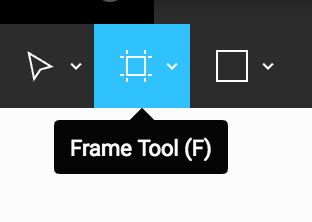{: .fancy}

Then click on "Desktop HD" on the panel that appears on the right hand side of the screen. There are other Frames for other types of media that have the exact pixel sizes for each device.

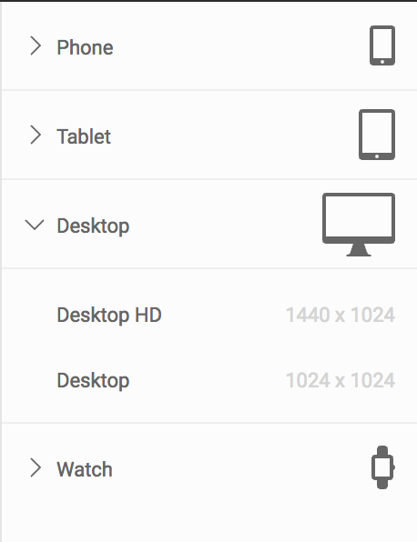{: .fancy .tiny}

Anything you add onto this frame will be grouped within the frame. Let's try this out.

Select the rectangle tool by clicking on it in the top bar, or by pressing "R":

{: .fancy }

Now try creating a rectangle over your white Frame. Press "R" again and now create one outside of the frame. You'll see on the left hand bar how the second rectangle was created outside of the frame you created but the first one is grouped within it.

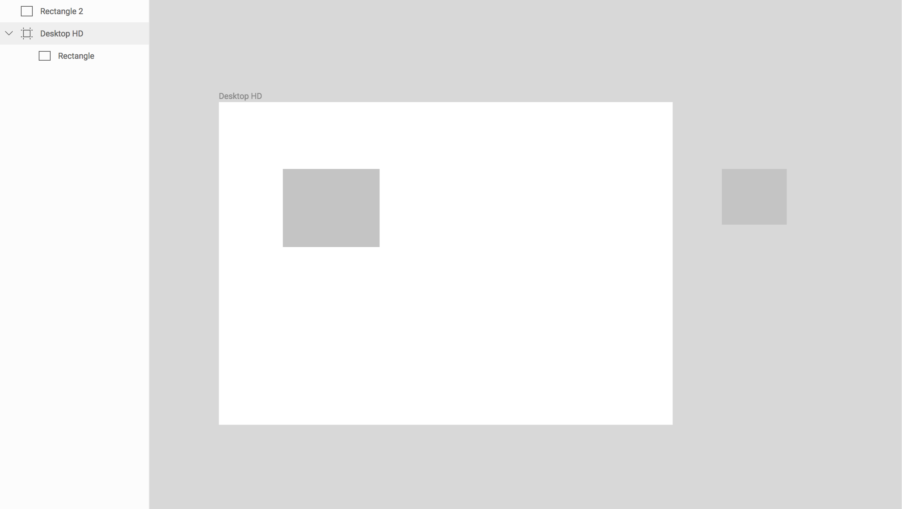{: .fancy .medium}

For the purposes of this assignment we want all of our assets to be within the frame we create so if you run into problems with layers etc. take a look at this sidebar.

If you move the rectangle from outside the frame into the frame, Figma automatically puts it into the Frame grouping.

## Creating your Quiz page

### Laying out page content

You might want to start by laying out the page just with rectangles at first and then spice things up with images later. Rectangles are the [basis of all modern design](https://medium.com/ux-power-tools/mega-trend-1-rectangles-a058515c859f) `#rectangles`.

When laying out your page, remember to think about the visual hierarchy.  What will users eyes see first, your call to action, or the large user profile button that they never really need to go to?  Try to imagine what you would notice first as a new user and then order your elements in terms of visual saliency appropriately. Larger and brighter colored things tend to be noticed first. Positioning also matters, we tend to look at things in a [letter F pattern](https://uxplanet.org/f-shaped-pattern-for-reading-content-80af79cd3394).

Using the rectangle tool create a layout that looks like this:

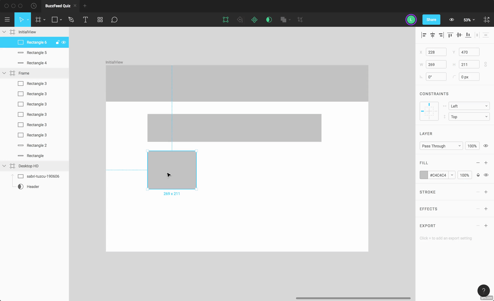{: .fancy .small}

Rename the rectangle layers to keep them organized.

*Pro-tips:*
- **Hold down Ctrl** (**Option** on Mac) and click and drag a rectangle to duplicate it
- **Hold down shift** and click multiple rectangles to select more than one
- Select three rectangles and then hold ctrl/option and drag them down to duplicate a row of rectangles to create the grid of question options

### Adding a background image and masking

Now to add a background image to the header.

If you're looking for a high resolution do-whatever-you-want images [https://unsplash.com/](https://unsplash.com/) and [https://www.pexels.com/](https://www.pexels.com/) are good sites.

Drag your image into Figma to 'place it'.

Your image will be large and out of place and we want it to be the background of our navbar.

To fix this, we want to create a **mask**.

Before masking:

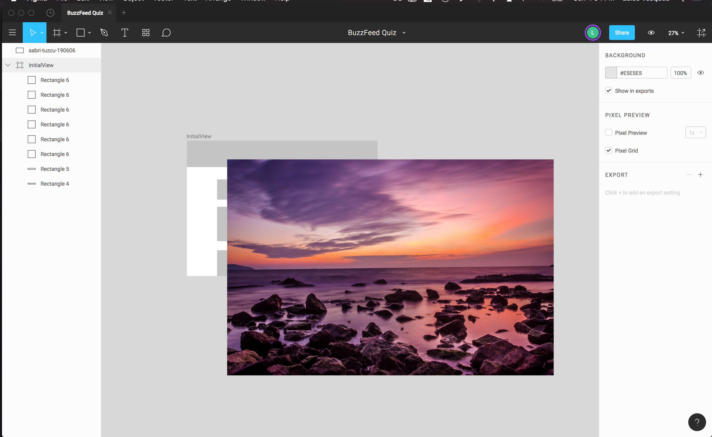{: .fancy }

First select your Header rectangle and holding down the Shift key, select your image. Now press the Mask button up at the top.

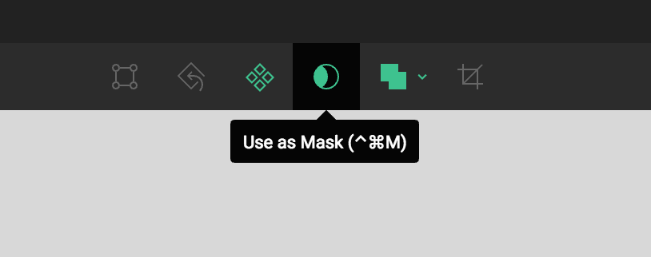{: .fancy .tiny}

Now the Header frame has become a sort of window frame for the image and you can resize and move the image until the header looks like you want it to.

Note: If you want to resize your image without messing up the proportions, hold down the Shift key as you change it's size.

Masked and positioned:

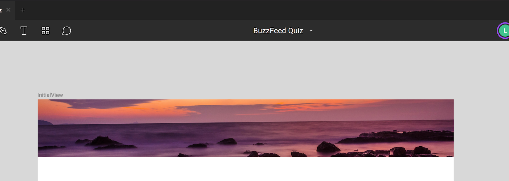{: .fancy }

To make the rest of editing easier, lock your header layer.

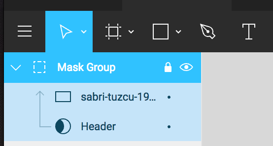{: .fancy .tiny}

You can also move the masked images down to the bottom of the layers to move them out of your way:

{: .fancy .tiny}

### Adding in content images

Repeat the masking process to add other images to the rest of your layout.

{: .fancy}

Your page should now look like this:

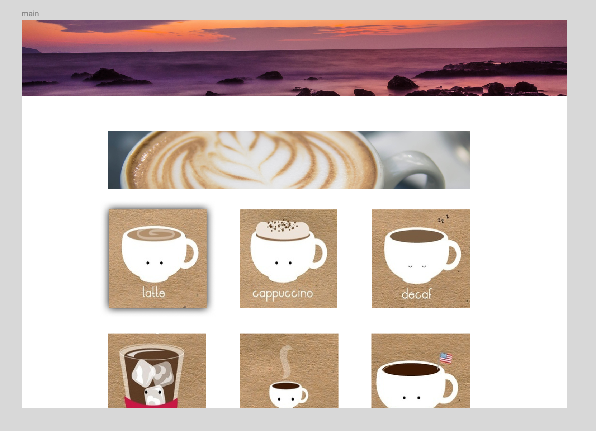{: .fancy .small}

### Adding text
Figma uses [Google fonts](https://fonts.google.com/), which means that later when you're developing your web page it will be easy to import the fonts you use in your Figma design.  Choosing fonts can be tricky and overwhelming.  Generally don't go overboard,  pick at most 2 or 3 fonts for your project and keep them simple. *Papyrus* is not a valid option.

**Press T** and then click where you want to place your text. Change the properties in the right hand panel.

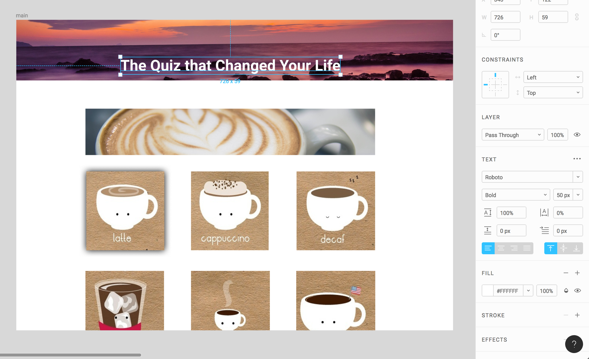{: .fancy .small}

Add text to your Question header as well, and your page should now look like this:

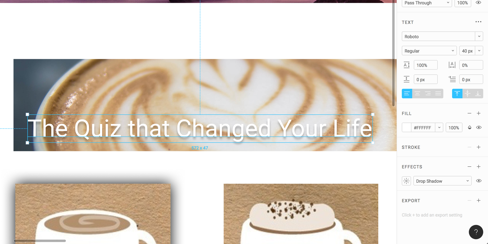{: .fancy .small}

If your text is hard to see you can try changing it's thickness, color, or adding a drop shadow.

#### Create checkboxes

Create a small white rectangle in the bottom right corner of your first image. To create a perfect square from the start, hold the Shift key down as you drag out the rectangle.

Click on fill and change the color to white. Copy and paste this on each option.

{: .fancy .small}

### Create multiple views

In order to design what your page would look like at different moments duplicate the main page you just designed and rename it for the two other states we need: Hover and Checked.  Having multiple states planned out in the design can help you both remember what needs to be built and also play around with different options quickly and easily to determine what works best for your product.

Select your frame, hold down *option/control* and click and drag it to the right. Rename this frame "hover". Repeat this and name the third frame "checked". Now we're going to edit these frames to match the state.

These are your three frames before you edit the second two:

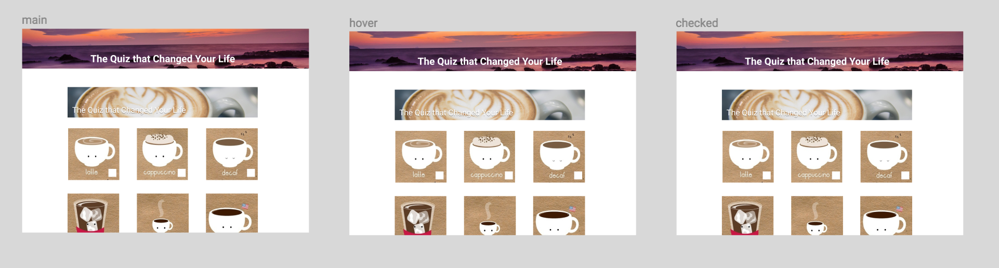{: .fancy .small}

### Hover:
**Make sure you're on the second frame now.**

So let's say we want our "hover" frame to look like this:

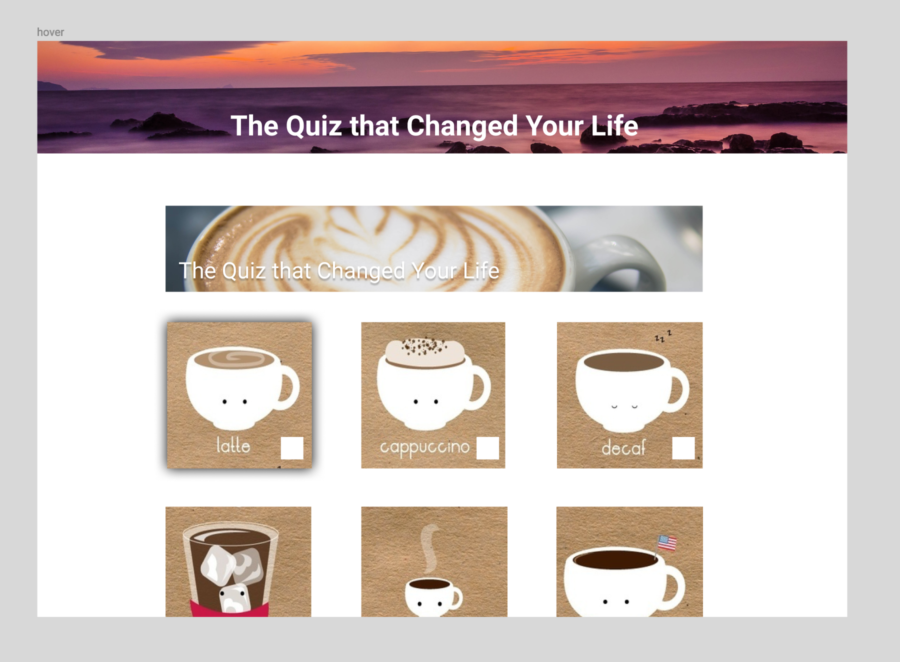{: .fancy .small}

#### Add drop shadow

Select the first question square, then in the Properties panel click the **+** next to **EFFECTS**. Make sure that Drop Shadow is selected and click the sun icon to edit the drop shadow as you want. Drop shadows are real popular these days.  We are in a post-flat era of design where having a bit of depth is nice, but don't go too far with the shadows. Think about depth levels with different drop shadow intensities and blurs corresponding to further or lower on the surface of the page.  You don't want things crashing into each other, or having mixed drop shadow angles.  Keep it simple but classy.

{: .fancy .small}

If you want it to add a drop shadow all the way around set the X and Y values to 0 and increase the blur; here we'll use 25px.

### Checked:
**Make sure you're on the third frame now.**

When a quiz option is selected we might want our "checked" frame to look something like this:

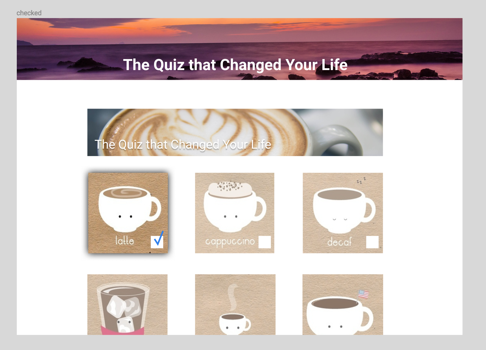{: .fancy .small}

Now to create the check we're going to use the **pen tool**. The pen tool creates a vector network.

**Press P** on your key board and then create a checkmark. I made mine with three points and then pressed enter to complete the path. Change the stroke color and stroke width to 5px.

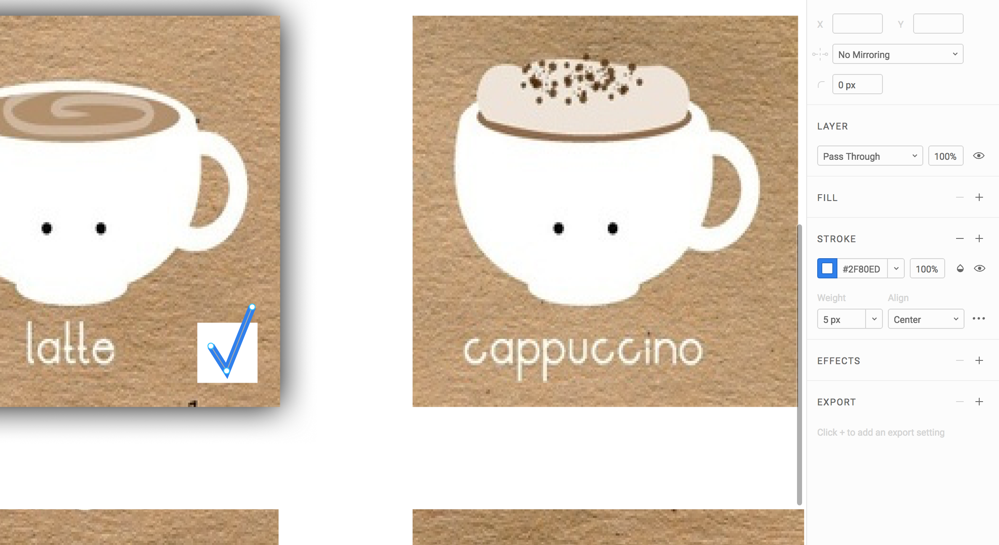{: .fancy .small}

#### Change opacity

Select the other 5 questions and change their "PASS THROUGH" property.

{: .fancy .tiny }

(I renamed the masked groups before this step to make it easier to track them and select them)

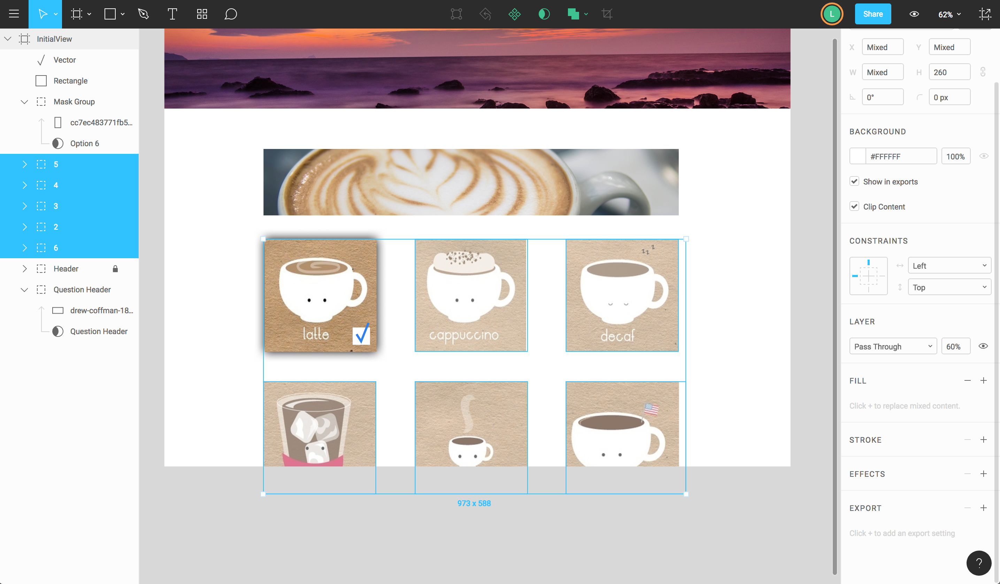{: .fancy .medium}

Now you have three different views showing the process of selecting an option on your quiz.

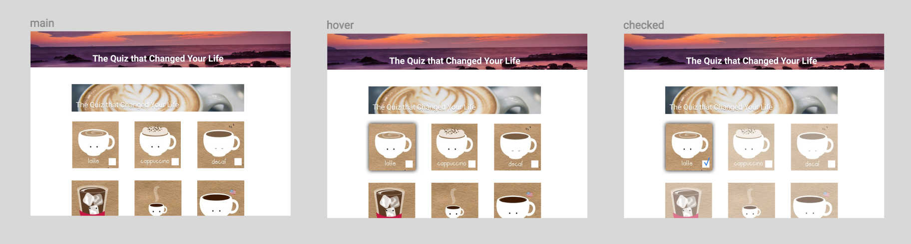{: .fancy .medium}

## Done for now!

Now you have all the skills necessary to keep playing with Figma and designing other potential views.  Check out some Buzzfeed quizzes. What other pages or views might you need? The next lab assignment will be building a fully functional Buzzfeed style quiz site but there will be quite a bit of content and design flexibility. Do you need to display the results of the quiz?  Where would the button to calculate your result go?
